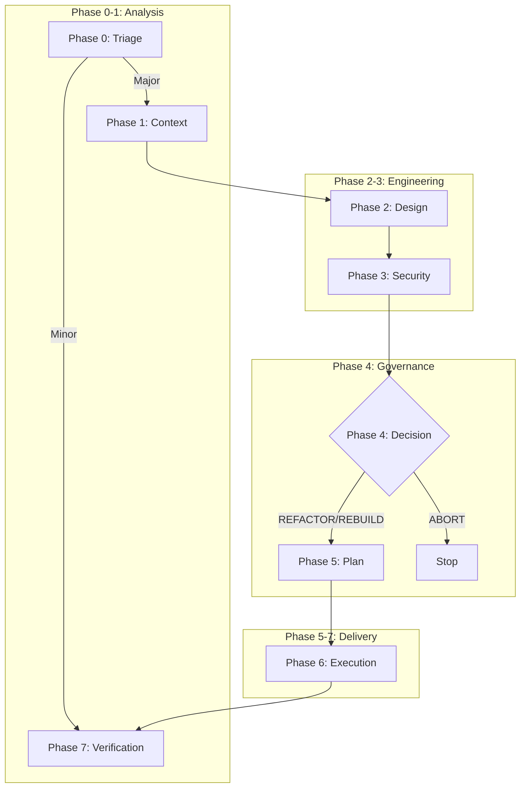

# SDLC AI

**AI-Assisted Software Development Life Cycle (Governance System)**

This repository hosts the **SDLC AI** system, a mature governance framework designed to enforce security, architectural integrity, and deterministic execution in AI-assisted coding workflows.

## System Philosophy
The system operates on the **Hybrid Governance Model (Phase 0-7)**, ensuring a strict balance between AI autonomy and Human authority.

### Key Principles
1.  **Double-Write Rule**: Every phase produces both a Human-Readable (`.md`) and Machine-Enforceable (`.json`) artifact.
2.  **The Ledger is Truth**: The `architecture/` directory acts as the immutable state of the project.
3.  **Human Firewall**: Critical decisions (Phase 4) require explicit human signature.

## 8-Phase Workflow

| Phase | Name | Command | Goal |
| :--- | :--- | :--- | :--- |
| **0** | **Triage** | `/phase-0-triage` | Classify risk (Major vs Minor). |
| **1** | **Context** | `/phase-1-context` | Analyze blast radius and dependencies. |
| **2** | **Design** | `/phase-2-design` | Architectural Design & Refactoring Analysis. |
| **3** | **Security** | `/phase-3-security` | Threat Modeling & Risk Assessment. |
| **4** | **Decision** | `/phase-4-decision` | **Human Gate**: Approve, Rebuild, or Abort. |
| **5** | **Plan** | `/phase-5-plan` | Generate deterministic execution spec. |
| **6** | **Execute** | `/phase-6-execute` | Code generation loop. |
| **7** | **Verify** | `/phase-7-verify` | Final Quality Gate. |

### Visual Workflow

For full details, see the [Governance Definition](governance/FLOW_AND_GOVERNANCE.md).

## Documentation
- **Governance Flow**: [governance/FLOW_AND_GOVERNANCE.md](governance/FLOW_AND_GOVERNANCE.md)
- **Workflows**: [.agent/workflows/](.agent/workflows/)
- **Schemas**: [schemas/](schemas/)

## License
MIT
