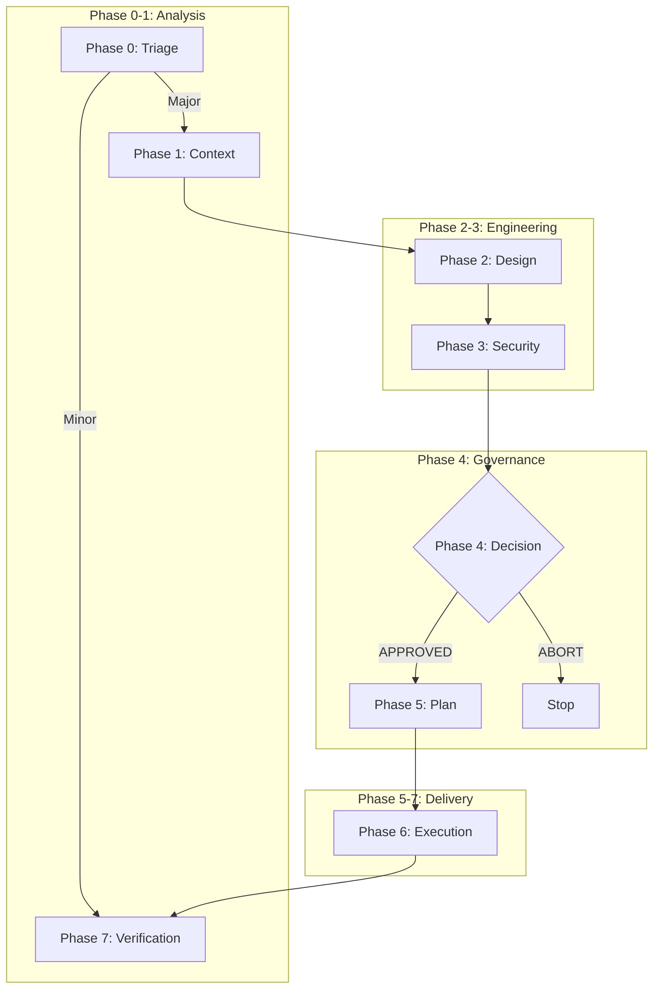

# Bulkhead


**AI-Assisted Software Development Life Cycle (Governance System)**

This repository hosts **Bulkhead**, a mature governance framework designed to enforce security, architectural integrity, and deterministic execution in AI-assisted coding workflows.

## 🚀 Quick Start

### Prerequisites
- **Antigravity** (Google Deepmind) or compatible AI agent environment.
- **Node.js 16+** (for schema validation).
- **Python 3.9+** (if running Python examples).
- **jq** (for manifest handling in update script).

### Your First Workflow
1.  **Initialize**: Copy `.bulkhead/templates/00-triage.template.md` to `.bulkhead/architecture/00-triage.md`.
2.  **Define**: Describe your change in the Triage document.
3.  **Validate**: Run `pre-commit run --all-files` to check your JSON.
4.  **Execute**: Follow the 8-phase workflow below.

## 📚 Documentation
- **Core Governance**: [FLOW_AND_GOVERNANCE.md](.bulkhead/governance/FLOW_AND_GOVERNANCE.md)
- **Schemas**: [.bulkhead/schemas/](.bulkhead/schemas/)
- **Templates**: [.bulkhead/templates/](.bulkhead/templates/)
- **Examples**: [examples/](examples/)
- **Changelog**: [CHANGELOG.md](CHANGELOG.md)

## 🔧 Workflows

Workflows are organized in `.agent/workflows/`:

| Directory | Purpose | Workflows |
|-----------|---------|-----------|
| `core/` | 8-phase SDLC | `bulkhead` (orchestrator), `phase-status`, `phase-0-triage` through `phase-7-verify`, `phase-checkpoint` |
| `specialized/` | Domain analysis | `review` (architecture/code/security), `modernization` |
| `integrations/` | External tools | `github-project`, `update-changelog` |

**Usage:** 
- **Orchestrator:** `/bulkhead start <phase>`, `/bulkhead continue`, `/bulkhead status`
- **Direct phase:** `/phase-0-triage`, `/phase-status`
- **Specialized:** `/review security`, `/modernization`

## ⚡ 8-Phase Workflow

| Phase | Name | Artifacts | Goal |
| :--- | :--- | :--- | :--- |
| **0** | **Triage** | `00-triage.{md,json}` | Classify risk (Major vs Minor). |
| **1** | **Context** | `01-context.{md,json}` | Analyze blast radius & dependencies. |
| **2** | **Design** | `02-design.{md,json}` | Architectural Design & Trade-offs. |
| **3** | **Security** | `03-security.{md,json}` | Threat Modeling (STRIDE). |
| **4** | **Decision** | `04-decision.{md,json}` | **Human Gate**: Approve or Abort. |
| **5** | **Plan** | `05-plan.{md,json}` | Deterministic execution plan. |
| **6** | **Execute** | `06-report.md` | Coding & Implementation. |
| **7** | **Verify** | `07-verify.md` | Final Quality Gate. |

### Visual Workflow


## 🛠 Features

### Double-Write Rule
Every phase produces two artifacts:
1.  **Human-Readable (`.md`)**: For reasoning, audit, and communication.
2.  **Machine-Enforceable (`.json`)**: For strict validation and automation.

### Human Firewall
**Phase 4** requires an explicit human signature in the `04-decision.json` file. The AI agent is forbidden from proceeding to code generation without this signed authorization.

### Automated Validation
We use JSON Schema to strictly validate all governance artifacts.
- **CI/CD**: GitHub Actions workflow automatically validates all PRs.
- **Local**: Pre-commit hooks ensure validity before commit.

### Adaptive Rigor Framework
Configure governance intensity based on change type:

| Profile | Use Case | JSON Artifacts | Human Gate |
|---------|----------|----------------|------------|
| `sandbox` | Prototyping | Lightweight | Optional (cannot merge to protected branches) |
| `standard` | Features | Key phases (0, 4) | Required |
| `maximum` | Architecture | All phases | Strict |

Configure in `.bulkhead/config.yaml`:
```yaml
version: "2.0"
rigor_profile: standard  # sandbox | standard | maximum
```

## 📂 Project Structure

### Source Repository (this repo)
```
.
├── .agent/workflows/       # Agent instructions for each phase
├── .bulkhead/
│   ├── architecture/       # Governance artifacts ledger
│   ├── governance/         # Core rules and philosophy
│   ├── schemas/            # JSON Schemas for validation
│   ├── templates/          # Blank templates for new tasks
│   └── update.sh           # Update script with merge support
├── examples/               # Complete worked examples
├── VERSION                 # Current framework version
├── CHANGELOG.md            # Version history
└── onboard.sh              # Onboarding script
```

### Onboarded Project Structure
```
your-project/
├── .agent/                 # Workflows (at root - agent convention)
├── .bulkhead/
│   ├── architecture/       # Your governance artifacts
│   ├── governance/         # Philosophy docs
│   ├── schemas/            # JSON Schemas
│   ├── templates/          # Phase templates
│   ├── manifest.json       # Version tracking
│   └── update.sh           # Update script
└── .github/workflows/      # CI/CD validation
```

## 📦 Onboarding to an Existing Project

### Quick Setup (Script)

```bash
# Clone this repo
git clone https://github.com/agarwalvipin/bulkhead.git

# Run the onboarding script
cd bulkhead
./onboard.sh /path/to/your/project
```

This will:
- Copy governance files into `.bulkhead/` directory
- Copy `.agent/` workflows to project root
- Create `.bulkhead/manifest.json` with version tracking and checksums
- Detect and handle conflicts with existing files

### Manual Setup

```bash
# Copy .agent to project root
cp -r .agent /path/to/your/project/

# Create .bulkhead directory and copy contents
mkdir -p /path/to/your/project/.bulkhead
cp -r schemas templates governance /path/to/your/project/.bulkhead/
cp update.sh /path/to/your/project/.bulkhead/

# Create the architecture ledger
mkdir -p /path/to/your/project/.bulkhead/architecture
```

📖 See the full [Onboarding Guide](docs/onboarding.md) for details.

## 🔄 Updating Bulkhead

Once onboarded, you can update to the latest version:

```bash
# Check for updates
.bulkhead/update.sh --check

# Apply update (with backup and merge)
.bulkhead/update.sh
```

The update script will:
1. **Backup** your current files to `.bulkhead/backup/`
2. **Preserve** any local customizations via 3-way merge
3. **Update** the manifest with the new version

See [CHANGELOG.md](CHANGELOG.md) for version history.

## License
MIT

