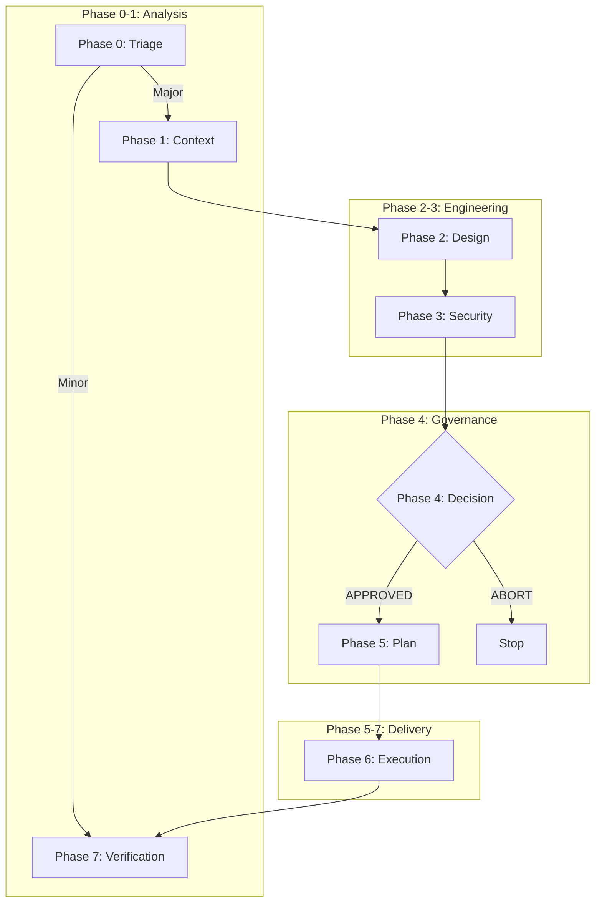

# Bulkhead


**AI-Assisted Software Development Life Cycle (Governance System)**

This repository hosts **Bulkhead**, a mature governance framework designed to enforce security, architectural integrity, and deterministic execution in AI-assisted coding workflows.

## 🤔 Why Bulkhead?

### The Problem

AI coding assistants are powerful, but without guardrails they can:

**Real-world scenarios:**
- 🔓 **Security**: AI suggests `eval(user_input)` for a "quick fix" that introduces code injection
- 🏗️ **Architecture**: AI adds a direct database call in the UI layer, bypassing your service architecture
- 🚪 **Backdoors**: AI makes incremental changes across 5 PRs that collectively bypass authentication
- 📈 **Tech Debt**: AI generates 3 different implementations of the same pattern because it lacks project context

### The Solution

Bulkhead provides **isolation and containment** for risky changes—just like the physical bulkheads in ships that prevent water from flooding all compartments:

- **Human Gates**: AI cannot proceed to code generation without explicit human approval (Phase 4)
- **Dual Artifacts**: Every decision produces both human-readable (`.md`) and machine-enforceable (`.json`) artifacts
- **Adaptive Rigor**: Match governance intensity to change risk (sandbox → standard → maximum)
- **Audit Trail**: Every architectural decision is documented and versioned in `.bulkhead/architecture/`

### Why "Bulkhead"?

In ships and spacecraft, **bulkheads** are walls that divide the structure into isolated compartments. If one compartment is breached, the bulkhead prevents the damage from spreading to other areas.

In this framework:
- Each **phase** is a compartment
- **Governance gates** are the bulkheads
- **Risky AI changes** are the potential breach
- **Human approval** seals the compartment before moving forward

> **Note**: This is NOT the "Bulkhead pattern" used in resilience engineering (like Resilience4j). Different domain, same principle: *compartmentalize risk*.

### How Does Bulkhead Compare?

| Approach | Speed | Security | Auditability | AI Safety | Best For |
|----------|-------|----------|--------------|-----------|----------|
| **Unstructured AI Coding** | ⚡⚡⚡ Fast | ⚠️ Risky | ❌ None | ❌ No guardrails | Prototypes, personal projects |
| **Traditional SDLC** | 🐌 Slow | ✅ Good | ✅ Good | ❌ No AI integration | Waterfall teams |
| **Bulkhead** | ⚡⚡ Fast | ✅ Excellent | ✅ Excellent | ✅ Built-in | **Production AI-assisted development** |

**Key Differentiator**: Bulkhead is the only approach that combines AI acceleration with enterprise-grade governance.

## 🎬 See It In Action

Before diving in, check out a complete worked example:

**📂 [examples/python-fastapi-jwt/](examples/python-fastapi-jwt/)**

This example shows the full 8-phase workflow for adding JWT authentication to a FastAPI service:
- ✅ All governance artifacts (`.md` and `.json`)
- 🔒 Security threat modeling (STRIDE analysis)
- 🚦 Human approval gate (Phase 4 decision)
- 💻 Complete implementation with tests
- ✔️ Verification results

**What you'll learn:**
- How to structure security-critical changes
- What each phase artifact looks like
- How the human approval gate works
- How to document architectural decisions

## 🚀 Quick Start

### Prerequisites
- **Antigravity** (Google Deepmind) or compatible AI agent environment
- **Node.js 16+** (for schema validation)

### Installation (60 seconds)

```bash
# Clone Bulkhead
git clone https://github.com/agarwalvipin/bulkhead.git
cd bulkhead

# Onboard to your project
./onboard.sh /path/to/your/project
```

### First Use (30 seconds)

In your project, just type:

```
/bulkhead
```

**What happens:**
1. 🔍 **Detects** your project state (new change? mid-workflow? ready to verify?)
2. 📋 **Shows** context-aware menu with available options
3. 🧭 **Guides** you through the appropriate phase

### Example Session

```
You: /bulkhead

AI: 🛡️ Bulkhead Governance System
    
    Project State: Clean (no active workflow)
    
    What would you like to do?
    1. Start new feature/change (Phase 0: Triage)
    2. View governance status
    3. Review past decisions
    
You: 1

AI: Starting Phase 0: Triage...
    
    Please describe the change you want to make.
```

### What Happens Next?

Based on your change classification:

**MAJOR change** (new feature, security, architecture):
```
Triage → Context → Design → Security → Decision (Human Gate) → Plan → Execute → Verify
         ⏱️ 15-30 min analysis          🚦 YOU APPROVE HERE    ⏱️ 10-60 min implementation
```

**MINOR change** (bug fix, small refactor):
```
Triage → Execute → Verify
         ⏱️ 2-5 min
```

The framework adapts to your needs—you only do the governance that matches the risk.

## 📚 Documentation
- **Core Governance**: [FLOW_AND_GOVERNANCE.md](governance/FLOW_AND_GOVERNANCE.md)
- **Onboarding Guide**: [docs/onboarding.md](docs/onboarding.md)
- **Workflow Scenarios**: [docs/workflow-scenarios.md](docs/workflow-scenarios.md)
- **Schemas**: [schemas/](schemas/)
- **Templates**: [templates/](templates/)
- **Changelog**: [CHANGELOG.md](CHANGELOG.md)

## 🔧 Workflows

Workflows are organized in `.agent/workflows/` with logical categories:

| Category | Path | Workflows |
|----------|------|-----------|
| **Orchestrator** | `bulkhead.md` | Smart entry point with state detection |
| **Core SDLC** | `core/` | `phase-0-triage` → `phase-7-verify`, `phase-status`, `phase-checkpoint` |
| **Orchestrators** | `orchestrators/` | `epic-orchestrator`, `modernization` |
| **Integrations** | `integrations/` | `github-project`, `pr-manager`, `changelog`, `feedback-loop` |
| **Specialized** | `specialized/` | `code-review`, `refactoring-executor`, `promote` |

**Usage:** 
- **Central entry point:** `/bulkhead` (shows context-aware options based on project state)
- **Status check:** `/bulkhead status`
- **Continue work:** `/bulkhead continue`

> [!IMPORTANT]
> Always prefer `/bulkhead` over direct commands. The smart router ensures you are in the correct state and have all necessary context before proceeding.

## ⚡ 8-Phase Workflow

| Phase | Name | Artifacts | Goal |
| :--- | :--- | :--- | :--- |
| **0** | **Triage** | `00-triage.{md,json}` | Classify risk (Major vs Minor). |
| **1** | **Context** | `01-context.{md,json}` | Analyze blast radius & dependencies. |
| **2** | **Design** | `02-design.{md,json}` | Architectural Design & Trade-offs. |
| **3** | **Security** | `03-security.{md,json}` | Threat Modeling (STRIDE). |
| **4** | **Decision** | `04-decision.{md,json}` | **Human Gate**: Approve or Abort. |
| **5** | **Plan** | `05-plan.{md,json}` | Deterministic execution plan. |
| **6** | **Execute** | `06-report.md` | Coding & Implementation. |
| **7** | **Verify** | `07-verify.md` | Final Quality Gate. |

### Visual Workflow

```mermaid
flowchart TD
    subgraph "Phase 0-1: Analysis"
        P0[Phase 0: Triage] -->|Major| P1[Phase 1: Context]
        P0 -->|Minor| P7[Phase 7: Fast Track]
    end

    subgraph "Phase 2-3: Engineering"
        P1 --> P2[Phase 2: Design]
        P2 --> P3[Phase 3: Security]
    end

    subgraph "Phase 4: Governance"
        P3 --> P4{Phase 4: Decision}
        P4 -->|APPROVED| P5[Phase 5: Plan]
        P4 -->|ABORT| Stop
    end

    subgraph "Phase 5-7: Delivery"
        P5 --> P6[Phase 6: Execution]
        P6 --> P7[Phase 7: Verification]
    end
```

## 🛠 Features

### Double-Write Rule
Every phase produces two artifacts:
1.  **Human-Readable (`.md`)**: For reasoning, audit, and communication.
2.  **Machine-Enforceable (`.json`)**: For strict validation and automation.

### Human Firewall
**Phase 4** requires an explicit human signature in the `04-decision.json` file. The AI agent is forbidden from proceeding to code generation without this signed authorization.

### Automated Validation
We use JSON Schema to strictly validate all governance artifacts.
- **CI/CD**: GitHub Actions workflow automatically validates all PRs.
- **Local**: Pre-commit hooks ensure validity before commit.

### Adaptive Rigor Framework
Configure governance intensity based on change type:

| Profile | Use Case | JSON Artifacts | Human Gate |
|---------|----------|----------------|------------|
| `sandbox` | Prototyping | Lightweight | Optional (cannot merge to protected branches) |
| `standard` | Features | Key phases (0, 4) | Required |
| `maximum` | Architecture | All phases | Strict |

Configure in `.bulkhead/config.yaml`:
```yaml
version: "2.0"
rigor_profile: standard  # sandbox | standard | maximum
```

## 📂 Project Structure

### Source Repository (this repo)
```
.
├── workflows/              # Workflow definitions (copied to .agent/ in targets)
│   ├── bulkhead.md         # Smart orchestrator (start here)
│   ├── core/               # 8-phase SDLC workflows
│   ├── orchestrators/      # Large project management
│   ├── integrations/       # GitHub, PR, changelog
│   └── specialized/        # Reviews, refactoring, promote
├── rules/                  # Governance rules (copied to .agent/ in targets)
├── schemas/                # JSON Schemas for validation
├── templates/              # Blank templates for new tasks
├── governance/             # Core rules and philosophy
├── migrations/             # Version migration scripts
├── architecture/           # Example governance artifacts
├── examples/               # Complete worked examples
├── docs/                   # Documentation and guides
├── VERSION                 # Current framework version
├── CHANGELOG.md            # Version history
├── onboard.sh              # Onboarding script
├── update.sh               # Update script with merge support
└── uninstall.sh            # Uninstall script
```

### Onboarded Project Structure
```
your-project/
├── .agent/                 # Workflows & rules (Antigravity convention)
│   ├── workflows/
│   │   ├── bulkhead.md     # Smart orchestrator
│   │   ├── core/           # Phase workflows
│   │   ├── orchestrators/  # Epic & modernization
│   │   ├── integrations/   # GitHub, PR, changelog
│   │   └── specialized/    # Reviews, promote
│   └── rules/              # Governance rules
├── .bulkhead/
│   ├── architecture/       # Your governance artifacts
│   ├── governance/         # Philosophy docs
│   ├── schemas/            # JSON Schemas
│   ├── templates/          # Phase templates
│   ├── migrations/         # Version migrations
│   ├── manifest.json       # Version tracking
│   ├── config.yaml         # Rigor configuration
│   ├── update.sh           # Update script
│   └── uninstall.sh        # Uninstall script
└── .github/workflows/      # CI/CD validation
```

## 📦 Onboarding to an Existing Project

### Quick Setup (Script)

```bash
# Clone this repo
git clone https://github.com/agarwalvipin/bulkhead.git

# Run the onboarding script
cd bulkhead
./onboard.sh /path/to/your/project
```

This will:
- Copy governance files into `.bulkhead/` directory
- Copy `.agent/` workflows to project root
- Create `.bulkhead/manifest.json` with version tracking and checksums
- Detect and handle conflicts with existing files

### Manual Setup

```bash
# Copy .agent to project root
cp -r .agent /path/to/your/project/

# Create .bulkhead directory and copy contents
mkdir -p /path/to/your/project/.bulkhead
cp -r schemas templates governance /path/to/your/project/.bulkhead/
cp update.sh /path/to/your/project/.bulkhead/

# Create the architecture ledger
mkdir -p /path/to/your/project/.bulkhead/architecture
```

📖 See the full [Onboarding Guide](docs/onboarding.md) for details.

## 🔄 Updating Bulkhead

Once onboarded, you can update to the latest version:

```bash
# Check for updates
.bulkhead/update.sh --check

# Apply update (with backup and merge)
.bulkhead/update.sh
```

The update script will:
1. **Backup** your current files to `.bulkhead/backup/`
2. **Preserve** any local customizations via 3-way merge
3. **Update** the manifest with the new version

See [CHANGELOG.md](CHANGELOG.md) for version history.

## 🧪 Testing

Bulkhead includes an automated test suite to validate JSON schemas and ensure ensuring governance logic correctness.

### Running Tests

```bash
# Run the full test suite
./run_tests.sh
```

This will:
1. Create a local python virtual environment
2. Install dependencies (`pytest`, `jsonschema`)
3. Validate all schema definitions against test data in `tests/schemas/`

You can add your own test cases by adding JSON files to `tests/schemas/valid/` or `tests/schemas/invalid/`.


## ❓ FAQ

<details>
<summary><strong>Is this related to Resilience4j's Bulkhead pattern?</strong></summary>

No. That Bulkhead pattern is about limiting concurrent requests to prevent cascade failures in distributed systems. 

This Bulkhead is about **isolating risky AI-generated changes** through governance phases. 

**Same metaphor (ship compartments), different domain:**
- **Resilience4j Bulkhead**: Limits concurrent threads/requests to prevent resource exhaustion
- **This Bulkhead**: Limits AI autonomy with governance gates to prevent ungoverned changes

Both prevent cascading failures, just in different contexts.
</details>

<details>
<summary><strong>Do I need all 8 phases for every change?</strong></summary>

No! The framework adapts based on risk:

**MINOR changes** (bug fixes, small refactors):
```
Triage → Execute → Verify
⏱️ ~5 minutes total
```

**MAJOR changes** (new features, security, architecture):
```
Triage → Context → Design → Security → Decision → Plan → Execute → Verify
⏱️ 30-90 minutes total (mostly AI work, you approve at Phase 4)
```

Use `/bulkhead` and it will automatically route you to the appropriate path based on your change classification.
</details>

<details>
<summary><strong>Can I customize the phases?</strong></summary>

Yes, in several ways:

1. **Rigor Profiles** - Set governance intensity in `.bulkhead/config.yaml`:
   - `sandbox`: Lightweight (prototyping)
   - `standard`: Balanced (feature development)
   - `maximum`: Strict (architecture/security)

2. **Custom Templates** - Modify `.bulkhead/templates/` to match your conventions

3. **Schema Extensions** - Add fields to `.bulkhead/schemas/` for your needs

4. **Custom Rules** - Extend `.agent/rules/` for project-specific AI behavior

5. **Workflow Modifications** - Edit `.agent/workflows/` for custom phases
</details>

<details>
<summary><strong>What AI agents are supported?</strong></summary>

**Primary:** Antigravity (Google DeepMind) - fully supported with native integration

**Compatible:** The workflows are standard markdown files, so they can be adapted for:
- Claude (Anthropic)
- Cursor
- GitHub Copilot Workspace
- Any AI assistant that supports markdown-based workflows

The `.agent/` directory structure follows Antigravity conventions, but the governance artifacts (`.bulkhead/`) are tool-agnostic.
</details>

<details>
<summary><strong>How does this work with existing CI/CD?</strong></summary>

Bulkhead integrates seamlessly:

1. **Pre-commit hooks** validate JSON artifacts locally
2. **GitHub Actions** enforce schema validation on PRs
3. **Branch protection** can require Phase 4 approval artifacts before merge
4. **Audit trail** in `.bulkhead/architecture/` provides compliance documentation

The framework doesn't replace your CI/CD—it adds governance gates before code reaches it.
</details>

<details>
<summary><strong>What if I'm working on a personal project?</strong></summary>

Use **sandbox rigor** for speed:

```yaml
# .bulkhead/config.yaml
rigor_profile: sandbox
```

This gives you:
- ✅ Lightweight JSON artifacts
- ✅ Optional human gates
- ✅ Fast iteration
- ⚠️ Cannot merge to protected branches without promoting to `standard`

When ready to ship, run `/bulkhead promote` to upgrade governance and generate full artifacts.
</details>

<details>
<summary><strong>How much overhead does this add?</strong></summary>

**Time investment:**
- MINOR changes: +2-5 minutes (triage + verify)
- MAJOR changes: +15-30 minutes (mostly AI analysis, you approve once)

**Value gained:**
- 🔒 Security vulnerabilities caught before implementation
- 📐 Architectural decisions documented and reviewable
- 🚫 Prevents 3-6 months of accumulated tech debt
- ✅ Compliance audit trail for regulated industries

**ROI**: The 30 minutes spent on governance saves hours of debugging, refactoring, and security patches later.
</details>

<details>
<summary><strong>Can I use this for non-AI development?</strong></summary>

Yes! While designed for AI-assisted workflows, Bulkhead works equally well for human-only development:

- Use the phase templates as structured thinking frameworks
- Generate governance artifacts manually
- Benefit from the audit trail and decision documentation
- Enforce architectural review gates

The `/bulkhead` workflows guide humans through the same rigorous process.
</details>

<details>
<summary><strong>What happens if I skip a phase?</strong></summary>

**By design, you can't.**

The workflows enforce strict serialization:
- Phase N requires Phase N-1's artifacts to exist
- JSON schema validation fails if prerequisites are missing
- CI/CD blocks PRs without required governance artifacts

This is intentional—skipping phases defeats the purpose of compartmentalized risk.

**Exception:** MINOR changes skip directly from Phase 0 (Triage) to Phase 6 (Execute), which is the intended fast path.
</details>

## License
MIT

