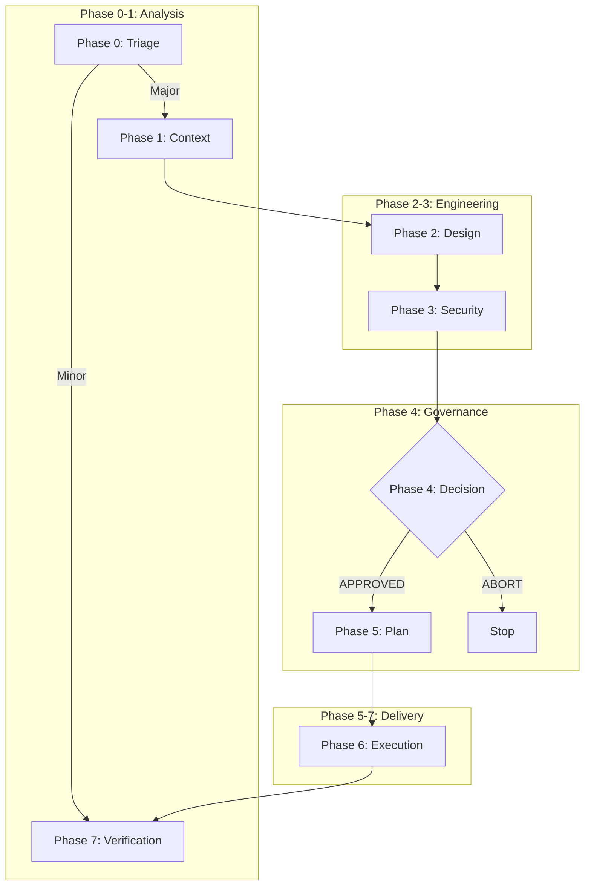

# Bulkhead


**AI-Assisted Software Development Life Cycle (Governance System)**

This repository hosts **Bulkhead**, a mature governance framework designed to enforce security, architectural integrity, and deterministic execution in AI-assisted coding workflows.

## 🤔 Why Bulkhead?

### The Problem

AI coding assistants are powerful, but without guardrails they can:
- Generate insecure code that passes code review
- Make architectural decisions that create technical debt
- Bypass approval processes by making changes incrementally

### The Solution

Bulkhead provides **isolation and containment** for risky changes—just like the physical bulkheads in ships that prevent water from flooding all compartments:

- **Human Gates**: AI cannot proceed to code generation without explicit human approval (Phase 4)
- **Dual Artifacts**: Every decision produces both human-readable (`.md`) and machine-enforceable (`.json`) artifacts
- **Adaptive Rigor**: Match governance intensity to change risk (sandbox → standard → maximum)

> **Note**: This is NOT the "Bulkhead pattern" used in resilience engineering (like Resilience4j). Different domain, same principle: *compartmentalize risk*.

## 🚀 Quick Start

### Prerequisites
- **Antigravity** (Google Deepmind) or compatible AI agent environment
- **Node.js 16+** (for schema validation)

### 60-Second Start

After onboarding Bulkhead to your project, just type:

```
/bulkhead
```

The smart orchestrator will:
1. **Detect** your project state (new change? mid-workflow? ready to verify?)
2. **Show** context-aware options
3. **Guide** you through the appropriate phase

That's it. The `/bulkhead` command is your single entry point—it handles routing to the right workflow based on your current state.

### What Happens Next?

For a **MAJOR change** (new feature, security, architecture), you'll go through:

```
Triage → Context → Design → Security → Decision (Human Gate) → Plan → Execute → Verify
```

For a **MINOR change** (bug fix, small refactor), you fast-track directly to execution.

> 📖 **See a complete example**: [examples/python-fastapi-jwt/](examples/python-fastapi-jwt/) shows the full 8-phase workflow for adding JWT authentication to a FastAPI service.

## 📚 Documentation
- **Core Governance**: [FLOW_AND_GOVERNANCE.md](governance/FLOW_AND_GOVERNANCE.md)
- **Onboarding Guide**: [docs/onboarding.md](docs/onboarding.md)
- **Workflow Scenarios**: [docs/workflow-scenarios.md](docs/workflow-scenarios.md)
- **Schemas**: [schemas/](schemas/)
- **Templates**: [templates/](templates/)
- **Changelog**: [CHANGELOG.md](CHANGELOG.md)

## 🔧 Workflows

Workflows are organized in `.agent/workflows/` with logical categories:

| Category | Path | Workflows |
|----------|------|-----------|
| **Orchestrator** | `bulkhead.md` | Smart entry point with state detection |
| **Core SDLC** | `core/` | `phase-0-triage` → `phase-7-verify`, `phase-status`, `phase-checkpoint` |
| **Orchestrators** | `orchestrators/` | `epic-orchestrator`, `modernization` |
| **Integrations** | `integrations/` | `github-project`, `pr-manager`, `changelog`, `feedback-loop` |
| **Specialized** | `specialized/` | `code-review`, `refactoring-executor`, `promote` |

**Usage:** 
- **Central entry point:** `/bulkhead` (shows context-aware options based on project state)
- **Status check:** `/bulkhead status`
- **Continue work:** `/bulkhead continue`

> [!IMPORTANT]
> Always prefer `/bulkhead` over direct commands. The smart router ensures you are in the correct state and have all necessary context before proceeding.

## ⚡ 8-Phase Workflow

| Phase | Name | Artifacts | Goal |
| :--- | :--- | :--- | :--- |
| **0** | **Triage** | `00-triage.{md,json}` | Classify risk (Major vs Minor). |
| **1** | **Context** | `01-context.{md,json}` | Analyze blast radius & dependencies. |
| **2** | **Design** | `02-design.{md,json}` | Architectural Design & Trade-offs. |
| **3** | **Security** | `03-security.{md,json}` | Threat Modeling (STRIDE). |
| **4** | **Decision** | `04-decision.{md,json}` | **Human Gate**: Approve or Abort. |
| **5** | **Plan** | `05-plan.{md,json}` | Deterministic execution plan. |
| **6** | **Execute** | `06-report.md` | Coding & Implementation. |
| **7** | **Verify** | `07-verify.md` | Final Quality Gate. |

### Visual Workflow

```mermaid
flowchart TD
    subgraph "Phase 0-1: Analysis"
        P0[Phase 0: Triage] -->|Major| P1[Phase 1: Context]
        P0 -->|Minor| P7[Phase 7: Fast Track]
    end

    subgraph "Phase 2-3: Engineering"
        P1 --> P2[Phase 2: Design]
        P2 --> P3[Phase 3: Security]
    end

    subgraph "Phase 4: Governance"
        P3 --> P4{Phase 4: Decision}
        P4 -->|APPROVED| P5[Phase 5: Plan]
        P4 -->|ABORT| Stop
    end

    subgraph "Phase 5-7: Delivery"
        P5 --> P6[Phase 6: Execution]
        P6 --> P7[Phase 7: Verification]
    end
```

## 🛠 Features

### Double-Write Rule
Every phase produces two artifacts:
1.  **Human-Readable (`.md`)**: For reasoning, audit, and communication.
2.  **Machine-Enforceable (`.json`)**: For strict validation and automation.

### Human Firewall
**Phase 4** requires an explicit human signature in the `04-decision.json` file. The AI agent is forbidden from proceeding to code generation without this signed authorization.

### Automated Validation
We use JSON Schema to strictly validate all governance artifacts.
- **CI/CD**: GitHub Actions workflow automatically validates all PRs.
- **Local**: Pre-commit hooks ensure validity before commit.

### Adaptive Rigor Framework
Configure governance intensity based on change type:

| Profile | Use Case | JSON Artifacts | Human Gate |
|---------|----------|----------------|------------|
| `sandbox` | Prototyping | Lightweight | Optional (cannot merge to protected branches) |
| `standard` | Features | Key phases (0, 4) | Required |
| `maximum` | Architecture | All phases | Strict |

Configure in `.bulkhead/config.yaml`:
```yaml
version: "2.0"
rigor_profile: standard  # sandbox | standard | maximum
```

## 📂 Project Structure

### Source Repository (this repo)
```
.
├── workflows/              # Workflow definitions (copied to .agent/ in targets)
│   ├── bulkhead.md         # Smart orchestrator (start here)
│   ├── core/               # 8-phase SDLC workflows
│   ├── orchestrators/      # Large project management
│   ├── integrations/       # GitHub, PR, changelog
│   └── specialized/        # Reviews, refactoring, promote
├── rules/                  # Governance rules (copied to .agent/ in targets)
├── schemas/                # JSON Schemas for validation
├── templates/              # Blank templates for new tasks
├── governance/             # Core rules and philosophy
├── migrations/             # Version migration scripts
├── architecture/           # Example governance artifacts
├── examples/               # Complete worked examples
├── docs/                   # Documentation and guides
├── VERSION                 # Current framework version
├── CHANGELOG.md            # Version history
├── onboard.sh              # Onboarding script
├── update.sh               # Update script with merge support
└── uninstall.sh            # Uninstall script
```

### Onboarded Project Structure
```
your-project/
├── .agent/                 # Workflows & rules (Antigravity convention)
│   ├── workflows/
│   │   ├── bulkhead.md     # Smart orchestrator
│   │   ├── core/           # Phase workflows
│   │   ├── orchestrators/  # Epic & modernization
│   │   ├── integrations/   # GitHub, PR, changelog
│   │   └── specialized/    # Reviews, promote
│   └── rules/              # Governance rules
├── .bulkhead/
│   ├── architecture/       # Your governance artifacts
│   ├── governance/         # Philosophy docs
│   ├── schemas/            # JSON Schemas
│   ├── templates/          # Phase templates
│   ├── migrations/         # Version migrations
│   ├── manifest.json       # Version tracking
│   ├── config.yaml         # Rigor configuration
│   ├── update.sh           # Update script
│   └── uninstall.sh        # Uninstall script
└── .github/workflows/      # CI/CD validation
```

## 📦 Onboarding to an Existing Project

### Quick Setup (Script)

```bash
# Clone this repo
git clone https://github.com/agarwalvipin/bulkhead.git

# Run the onboarding script
cd bulkhead
./onboard.sh /path/to/your/project
```

This will:
- Copy governance files into `.bulkhead/` directory
- Copy `.agent/` workflows to project root
- Create `.bulkhead/manifest.json` with version tracking and checksums
- Detect and handle conflicts with existing files

### Manual Setup

```bash
# Copy .agent to project root
cp -r .agent /path/to/your/project/

# Create .bulkhead directory and copy contents
mkdir -p /path/to/your/project/.bulkhead
cp -r schemas templates governance /path/to/your/project/.bulkhead/
cp update.sh /path/to/your/project/.bulkhead/

# Create the architecture ledger
mkdir -p /path/to/your/project/.bulkhead/architecture
```

📖 See the full [Onboarding Guide](docs/onboarding.md) for details.

## 🔄 Updating Bulkhead

Once onboarded, you can update to the latest version:

```bash
# Check for updates
.bulkhead/update.sh --check

# Apply update (with backup and merge)
.bulkhead/update.sh
```

The update script will:
1. **Backup** your current files to `.bulkhead/backup/`
2. **Preserve** any local customizations via 3-way merge
3. **Update** the manifest with the new version

See [CHANGELOG.md](CHANGELOG.md) for version history.

## ❓ FAQ

<details>
<summary><strong>Is this related to Resilience4j's Bulkhead pattern?</strong></summary>

No. That Bulkhead pattern is about limiting concurrent requests to prevent cascade failures. This Bulkhead is about **isolating risky AI-generated changes** through governance phases. Same metaphor (ship compartments), different domain.
</details>

<details>
<summary><strong>Do I need all 8 phases for every change?</strong></summary>

No! The framework adapts:
- **MINOR changes** (bug fixes, small refactors) fast-track directly to execution
- **MAJOR changes** (new features, security, architecture) go through full governance
- Use `/bulkhead` and it will guide you to the right path
</details>

<details>
<summary><strong>Can I customize the phases?</strong></summary>

Yes, in several ways:
- **Rigor profiles** (`sandbox`, `standard`, `maximum`) in `.bulkhead/config.yaml`
- **Custom templates** in `.bulkhead/templates/`
- **Modified schemas** in `.bulkhead/schemas/`
- **Custom rules** in `.agent/rules/`
</details>

<details>
<summary><strong>What AI agents are supported?</strong></summary>

Currently designed for **Antigravity** (Google DeepMind), but the workflows are standard markdown that can be adapted for other AI coding assistants like Claude, Cursor, or Copilot Workspace.
</details>

## License
MIT

