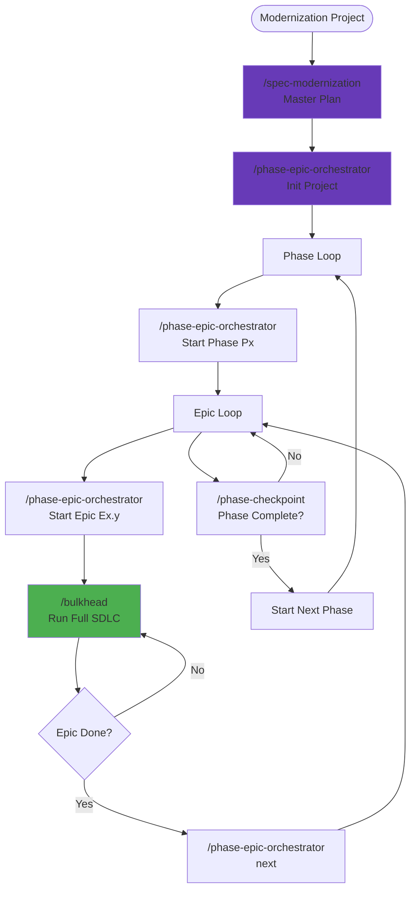

# Bulkhead Workflow Scenarios - Flow Diagrams

This document provides visual flow diagrams for various scenarios demonstrating how Bulkhead workflows can be used together.

---

## Scenario 1: New Feature Development (Full SDLC)

```mermaid
graph TD
    Start([New Feature Request]) --> Bulkhead["/bulkhead&#10;Orchestrator Entry"]
    
    Bulkhead --> P0["/phase-0-triage&#10;Economic Control"]
    P0 --> P0Decision{Worth&#10;investing?}
    P0Decision -->|No| Reject([Document & Reject])
    P0Decision -->|Yes| P1["/phase-1-context&#10;Blast Radius"]
    
    P1 --> P1Doc["Document scope,&#10;dependencies, impact"]
    P1Doc --> P2["/phase-2-design&#10;Architectural Analysis"]
    
    P2 --> P2Review["/architect-review&#10;Evaluate Design"]
    P2Review --> P2Decision{Design&#10;approved?}
    P2Decision -->|Issues Found| P2
    P2Decision -->|Approved| P3["/phase-3-security&#10;Threat Modeling"]
    
    P3 --> Sec["/security-architect&#10;Security Review"]
    Sec --> P3Decision{Security&#10;risks OK?}
    P3Decision -->|Unacceptable| P2
    P3Decision -->|Mitigated| P4["/phase-4-decision&#10;Decision Gate"]
    
    P4 --> P4Decision{Proceed?}
    P4Decision -->|No| Stop([Stop Development])
    P4Decision -->|Yes| P5["/phase-5-plan&#10;Orchestration"]
    
    P5 --> GitProject["/int-github-project&#10;Create Epic & Stories"]
    GitProject --> Checkpoint["/phase-checkpoint&#10;Validate Artifacts"]
    
    Checkpoint --> CheckOK{All artifacts&#10;complete?}
    CheckOK -->|Missing| P5
    CheckOK -->|Complete| P6["/phase-6-execute&#10;Coding"]
    
    P6 --> Code[Write Code]
    Code --> P7["/phase-7-verify&#10;Quality Gate"]
    
    P7 --> Tests["Run Tests&#10;& Verification"]
    Tests --> CodeRev["/code-review&#10;Review Changes"]
    CodeRev --> P7Decision{Quality&#10;passed?}
    P7Decision -->|Issues| P6
    P7Decision -->|Passed| Changelog["/int-update-changelog&#10;Update CHANGELOG"]
    
    Changelog --> Done([Merge & Deploy])
    
    style Bulkhead fill:#4CAF50
    style P0 fill:#2196F3
    style P1 fill:#2196F3
    style P2 fill:#2196F3
    style P3 fill:#2196F3
    style P4 fill:#FF9800
    style P5 fill:#9C27B0
    style P6 fill:#9C27B0
    style P7 fill:#9C27B0
    style Checkpoint fill:#FF5722
```

### Step-by-Step Guide
1. **Governance Gates (Phases 0-4)**: Establish economic viability (`/phase-0-triage`), impact (`/phase-1-context`), design (`/phase-2-design`), and security (`/phase-3-security`). Finally, get approval at the Decision Gate (`/phase-4-decision`).
2. **Planning**: Use `/phase-5-plan` to break down tasks and `/int-github-project` to sync them to the project board.
3. **Execution**: Write code in Phase 6 (`/phase-6-execute`), then verify against acceptance criteria in Phase 7 (`/phase-7-verify`).
4. **Completion**: Update changelog (`/int-update-changelog`) and merge.

---

## Scenario 2: Legacy System Modernization

```mermaid
graph TD
    Start(["Legacy System&#10;Needs Update"]) --> Status["/phase-status&#10;Check Current State"]
    
    Status --> SpecMod["/spec-modernization&#10;Evaluate System"]
    
    SpecMod --> Analysis["Analyze:&#10;- Technical debt&#10;- Test coverage&#10;- Business logic&#10;- Dependencies"]
    
    Analysis --> RebuildRefactor["/rebuild-vs-refactor&#10;Decision Analysis"]
    
    RebuildRefactor --> Metrics["Calculate:&#10;- Refactor cost&#10;- Rebuild cost&#10;- Risk scores&#10;- Timeline estimates"]
    
    Metrics --> Decision{Decision?}
    
    Decision -->|REFACTOR| RefactorPath[Refactoring Path]
    Decision -->|REBUILD| RebuildPath[Rebuild Path]
    
    RefactorPath --> RefArch["/refactoring-architect&#10;Component Analysis"]
    RefArch --> RefPlan["Generate:&#10;- Component extraction&#10;- Tech stack survey&#10;- Phased plan"]
    RefPlan --> BulkheadRefactor["/bulkhead&#10;Start Refactor SDLC"]
    
    RebuildPath --> BulkheadRebuild["/bulkhead&#10;Start Rebuild SDLC"]
    
    BulkheadRefactor --> Phases1["Execute Phases 0-7&#10;for each component"]
    BulkheadRebuild --> Phases2["Execute Phases 0-7&#10;for new system"]
    
    Phases1 --> Complete([Modernization Complete])
    Phases2 --> Complete
    
    style SpecMod fill:#673AB7
    style RebuildRefactor fill:#FF9800
    style RefArch fill:#673AB7
    style Decision fill:#FF5722
```

### Legacy Modernization Flow
1. **Analysis**: Run `/spec-modernization` to assess the system. Then use `/rebuild-vs-refactor` to analytically compare the cost and risk of refactoring vs rebuilding.
2. **Refactor Path**: Use `/refactoring-architect` to plan component extraction and execute via Phased Refactoring.
3. **Rebuild Path**: Treat as a standard "Greenfields" project using `/bulkhead start`.

---

## Scenario 3: Security-First Infrastructure Change

```mermaid
graph TD
    Start(["Infrastructure&#10;Change Request"]) --> Check["Check INFRA-3:&#10;Decision record&#10;required?"]
    
    Check --> P0["/phase-0-triage&#10;Economic Control"]
    
    P0 --> P0Check{Approved?}
    P0Check -->|No| Stop([Stop])
    P0Check -->|Yes| P1["/phase-1-context&#10;Blast Radius"]
    
    P1 --> BlastRadius["Identify:&#10;- Network exposure&#10;- Service dependencies&#10;- Data flow changes"]
    
    BlastRadius --> P2["/phase-2-design&#10;Architectural Analysis"]
    
    P2 --> ArchReview["/architect-review&#10;Infrastructure Design"]
    
    ArchReview --> InfraCheck{"INFRA-1&#10;All explicit?"}
    InfraCheck -->|Defaults Found| P2
    InfraCheck -->|All Explicit| P3["/phase-3-security&#10;Threat Modeling"]
    
    P3 --> SecArch["/security-architect&#10;Security Analysis"]
    
    SecArch --> ThreatModel["Document:&#10;- Attack surface&#10;- Secret handling&#10;- Network exposure&#10;INFRA-2 Required"]
    
    ThreatModel --> SecCheck{"INFRA-5&#10;Network change?"}
    SecCheck -->|Yes| DeepReview["Deep Security Review:&#10;- Ports & ingress&#10;- DNS & proxies&#10;- Policy enforcement"]
    SecCheck -->|No| SecretCheck
    
    DeepReview --> SecretCheck{"INFRA-4&#10;Secrets OK?"}
    SecretCheck -->|Inline Found| P3
    SecretCheck -->|Properly Managed| P4["/phase-4-decision&#10;Decision Gate"]
    
    P4 --> CreateDecision["Create&#10;04-decision-record.md"]
    CreateDecision --> P4Approve{Approved?}
    P4Approve -->|No| Stop2([Stop])
    P4Approve -->|Yes| Proceed["Proceed to&#10;Phase 5-7"]
    
    Proceed --> Deploy([Deploy Infrastructure])
    
    style P3 fill:#F44336
    style SecArch fill:#F44336
    style ThreatModel fill:#F44336
    style DeepReview fill:#FF5722
```

### Security-First Protocol (INFRA Rules)
**Approvals Required**: Security Architect, Infrastructure Lead.

1. **INFRA-1 (No Defaults)**: All ports, networks, and creds must be explicit in `02-design.json`.
2. **INFRA-2 (Threat Model)**: `03-security.json` is mandatory.
3. **INFRA-3 (Decision Record)**: `04-decision-record.md` required before any provisioning.
4. **INFRA-5 (Network)**: No fast-tracking for network changes.

**Workflow**: `/phase-3-security` -> `/security-architect` -> `/phase-4-decision`.

---

## Scenario 4: Continuous Development Cycle

```mermaid
graph TD
    Start(["Developer Ready&#10;to Work"]) --> Status["/phase-status&#10;Check Dashboard"]
    
    Status --> StatusCheck{"Current&#10;Phase?"}
    
    StatusCheck -->|No Active Work| NewWork["/bulkhead&#10;Start New Work"]
    StatusCheck -->|In Planning| Planning["Continue Planning&#10;Phases 0-4"]
    StatusCheck -->|In Execution| Execution["Continue Execution&#10;Phases 5-7"]
    StatusCheck -->|In Review| Review["Address Review&#10;Comments"]
    
    NewWork --> FullCycle["Execute Full&#10;SDLC Cycle"]
    
    Planning --> UpdateArtifacts["Update Architecture&#10;Artifacts"]
    UpdateArtifacts --> PlanningReview["/architect-review or&#10;/security-architect"]
    PlanningReview --> CheckPoint1["/phase-checkpoint&#10;Ready for execution?"]
    CheckPoint1 --> Proceed1{Complete?}
    Proceed1 -->|No| Planning
    Proceed1 -->|Yes| ToExecution[Move to Execution]
    
    Execution --> GitSync["/int-github-project&#10;Update Epic Status"]
    GitSync --> WriteCode[Implement Features]
    WriteCode --> Verify["/phase-7-verify&#10;Run Tests"]
    Verify --> VerifyOK{All Pass?}
    VerifyOK -->|No| Execution
    VerifyOK -->|Yes| CreatePR[Create Pull Request]
    
    CreatePR --> CodeReviewFlow["/code-review&#10;Review PR"]
    
    Review --> AddressComments[Fix Issues]
    AddressComments --> Reverify[Re-verify]
    Reverify --> UpdatePR[Update PR]
    
    CodeReviewFlow --> ReviewDecision{Approved?}
    UpdatePR --> CodeReviewFlow
    
    ReviewDecision -->|Changes Requested| Review
    ReviewDecision -->|Approved| UpdateLog["/int-update-changelog&#10;Document Changes"]
    
    UpdateLog --> Merge([Merge to Main])
    ToExecution --> Execution
    FullCycle --> Merge
    
    Merge --> Status
    
    style Status fill:#4CAF50
    style Merge fill:#4CAF50
```

### Daily Developer Workflow
1. **Morning**: Check `/phase-status` dashboard.
2. **Coding**: Run `/bulkhead continue` to restore context (branch, phase, active task).
3. **Review**: Use `/int-pr-manager` to create PRs and `gh` to update status.

---

## Scenario 5: Parallel Work Management

```mermaid
graph TD
    Start(["Multiple Teams&#10;Working"]) --> Team1[Team 1: Feature A]
    Start --> Team2[Team 2: Feature B]
    Start --> Team3[Team 3: Security Audit]
    
    Team1 --> B1["/bulkhead&#10;Feature A SDLC"]
    Team2 --> B2["/bulkhead&#10;Feature B SDLC"]
    Team3 --> SecOnly["/security-architect&#10;Audit Existing Code"]
    
    B1 --> GP1["/int-github-project&#10;Epic: Feature A"]
    B2 --> GP2["/int-github-project&#10;Epic: Feature B"]
    
    GP1 --> Branch1["Branch:&#10;feature/feature-a"]
    GP2 --> Branch2["Branch:&#10;feature/feature-b"]
    
    Branch1 --> Execute1["Phases 0-7&#10;Feature A"]
    Branch2 --> Execute2["Phases 0-7&#10;Feature B"]
    SecOnly --> SecReport["Security Report&#10;& Recommendations"]
    
    Execute1 --> PR1[PR: Feature A]
    Execute2 --> PR2[PR: Feature B]
    SecReport --> SecIssues["Create Security&#10;Issues/Epics"]
    
    PR1 --> CR1["/code-review&#10;Review Feature A"]
    PR2 --> CR2["/code-review&#10;Review Feature B"]
    
    SecIssues --> PriorityCheck{Critical?}
    PriorityCheck -->|Yes| HotfixBulkhead["/bulkhead&#10;Security Hotfix"]
    PriorityCheck -->|No| Backlog[Add to Backlog]
    
    CR1 --> Merge1{Conflicts?}
    CR2 --> Merge2{Conflicts?}
    
    Merge1 -->|No| M1[Merge Feature A]
    Merge2 -->|No| M2[Merge Feature B]
    Merge1 -->|Yes| Resolve1[Resolve Conflicts]
    Merge2 -->|Yes| Resolve2[Resolve Conflicts]
    
    Resolve1 --> CR1
    Resolve2 --> CR2
    
    HotfixBulkhead --> HotfixPR[Hotfix PR]
    HotfixPR --> CRSec["/code-review&#10;Review Hotfix"]
    CRSec --> MergeSec[Merge Security Fix]
    
    M1 --> CL1["/int-update-changelog"]
    M2 --> CL2["/int-update-changelog"]
    MergeSec --> CL3["/int-update-changelog"]
    
    CL1 --> Done([Release])
    CL2 --> Done
    CL3 --> Done
    Backlog --> Done
    
    style Done fill:#4CAF50
```

### Parallel Work Management
Orchestrates multiple teams (Feature A, Feature B, Audit) simultaneously.

- **Feature Teams**: Each runs an isolated SDLC using `/int-github-project` to track separate epics/branches.
- **Security Team**: Runs `/security-architect` in parallel to inject issues into the backlog.
- **Merge Strategy**: Frequent `/code-review` and automated changelog handling to ensure a clean release history.

---

## Scenario 6: Emergency Response

```mermaid
graph TD
    Start(["Production Issue&#10;Detected"]) --> Severity{Severity?}
    
    Severity -->|P0 - Critical| Emergency[Emergency Response]
    Severity -->|P1-P2| Standard[Standard Process]
    
    Emergency --> HotfixBranch["Create hotfix branch&#10;from main"]
    HotfixBranch --> FastTrack["Condensed bulkhead:&#10;Combined P0-P1-P2"]
    
    FastTrack --> QuickDesign["Quick Design&#10;& Security Check"]
    QuickDesign --> InfraCheck{"Infrastructure&#10;change?"}
    
    InfraCheck -->|Yes| InfraRules["INFRA-5:&#10;NO FAST-TRACK&#10;Security Required"]
    InfraCheck -->|No| P3Fast["Fast P3:&#10;Security Review"]
    
    InfraRules --> FullSec["/security-architect&#10;Full Security Review"]
    FullSec --> P4Gate["/phase-4-decision&#10;Decision Gate"]
    
    P3Fast --> SecOK{"Security&#10;OK?"}
    SecOK -->|No| FullSec
    SecOK -->|Yes| P4Gate
    
    P4Gate --> Approve{Approved?}
    Approve -->|No| Stop([Stop & Reassess])
    Approve -->|Yes| QuickImpl[Quick Implementation]
    
    QuickImpl --> TestHotfix["/phase-7-verify&#10;Verify Hotfix"]
    TestHotfix --> TestOK{Tests Pass?}
    TestOK -->|No| QuickImpl
    TestOK -->|Yes| ExpressReview[Express Code Review]
    
    ExpressReview --> Deploy([Deploy Hotfix])
    
    Standard --> BulkheadStd["/bulkhead&#10;Standard SDLC"]
    BulkheadStd --> NormalDeploy([Normal Deployment])
    
    Deploy --> Postmortem["Document in&#10;.bulkhead/architecture/"]
    Postmortem --> ChangelogHotfix["/int-update-changelog"]
    ChangelogHotfix --> Monitor([Monitor & Close])
    
    style Emergency fill:#F44336
    style InfraRules fill:#FF5722
    style Deploy fill:#4CAF50
```

### Emergency Hotfix Protocol (P0)
**Goal**: Rapid fix while maintaining safety.

1. **Fast-Track Triage**: Determine severity. If P0, enter emergency mode.
2. **Condensed Governance**: Combine Phases 0-2 into a single pass.
   > **⚠️ CRITICAL**: If Infrastructure changes are involved (INFRA-5), you **CANNOT** fast-track security. Standard P3 review is mandatory.
3. **Rapid Execution**: Implement -> Verify -> Express Review -> Deploy -> Post-mortem.

---

## Scenario 7: Refactoring Decision Flow

```mermaid
graph TD
    Start(["Legacy System&#10;with Issues"]) --> Initial[Initial Assessment]
    
    Initial --> SpecMod["/spec-modernization&#10;Comprehensive Evaluation"]
    
    SpecMod --> Gather["Gather Data:&#10;- Code metrics&#10;- Test coverage&#10;- Dependencies&#10;- Team knowledge"]
    
    Gather --> RvR["/rebuild-vs-refactor&#10;Decision Analysis"]
    
    RvR --> Metrics[Calculate Metrics]
    
    Metrics --> TechDebt["Technical Debt Score&#10;0-10"]
    Metrics --> TestCov["Test Coverage&#10;percentage"]
    Metrics --> BizLogic["Business Logic&#10;Understanding&#10;0-10"]
    Metrics --> RefactorCost["Refactor Cost&#10;Estimate"]
    Metrics --> RebuildCost["Rebuild Cost&#10;Estimate"]
    
    TechDebt --> Decision{"Decision&#10;Algorithm"}
    TestCov --> Decision
    BizLogic --> Decision
    RefactorCost --> Decision
    RebuildCost --> Decision
    
    Decision -->|REFACTOR| RefactorDecision["Document:&#10;REFACTOR chosen"]
    Decision -->|REBUILD| RebuildDecision["Document:&#10;REBUILD chosen"]
    
    RefactorDecision --> RefArch["/refactoring-architect&#10;Plan Refactor"]
    
    RefArch --> ComponentAnalysis[Component Analysis]
    ComponentAnalysis --> ExtractComps[Extract Components]
    ExtractComps --> TechSurvey["Survey Modern&#10;Tech Stack"]
    TechSurvey --> PhasedPlan["Generate Phased&#10;Refactor Plan"]
    
    PhasedPlan --> PhaseLoop[For Each Phase]
    
    PhaseLoop --> PhaseBulkhead["/bulkhead&#10;Execute Phase"]
    PhaseBulkhead --> PhaseComplete{"More&#10;Phases?"}
    PhaseComplete -->|Yes| PhaseLoop
    PhaseComplete -->|No| RefactorDone([Refactor Complete])
    
    RebuildDecision --> NewDesign[Design New System]
    NewDesign --> BulkheadNew["/bulkhead&#10;Build New System"]
    BulkheadNew --> RebuildComplete([Rebuild Complete])
    
    style SpecMod fill:#673AB7
    style RvR fill:#FF9800
    style RefArch fill:#673AB7
    style Decision fill:#FF5722
```

### Refactoring Decision Matrix
Data-driven approach to architectural changes.

1. **Calculate Metrics**: Use `/rebuild-vs-refactor` to score Technical Debt, Test Coverage, and Complexity.
2. **Cost Analysis**: Compare Refactor Effort vs Rebuild Capital.
3. **Execution**:
   - **Refactor**: Plan component extraction with `/refactoring-architect`.
   - **Rebuild**: Start fresh with `/bulkhead`.

---

## Scenario 8: Large Codebase Orchestration

### Large Codebase Flow
Designed for enterprise modernization projects with nested hierarchy.

1. **Hierarchy**: Project -> Phase -> Epic -> SDLC.
2. **Planning**: Use `/spec-modernization` to create the master plan.
3. **Orchestration**: Use `/phase-epic-orchestrator` to manage phase transitions and gates.
4. **Execution**: Each Epic runs a full 0-7 SDLC.

[Full Guide: Large Codebase Refactoring](refactoring-guide.html)

---

## Quick Reference: Workflow Types

### Core Workflows
- 🚀 `/bulkhead` - Main orchestrator, entry point for all work
- 📊 `/phase-status` - Dashboard, check current state (read-only)
- ✅ `/phase-checkpoint` - Validate before execution
- 📝 `/phase-0-triage` through `/phase-7-verify` - Individual phases

### Integration Workflows  
- 📋 `/int-github-project` - Project management integration
- 📜 `/int-update-changelog` - Documentation updates

### Specialized Workflows
- 🏗️ `/architect-review` - Architecture evaluation
- 🔒 `/security-architect` - Security analysis
- 🔄 `/rebuild-vs-refactor` - Modernization decision
- 🎯 `/refactoring-architect` - Refactor planning
- 🔧 `/spec-modernization` - Comprehensive legacy evaluation
- 👁️ `/code-review` - Code review process

---

## Governance Rules Summary

> [!IMPORTANT]
> **AI Governance Rules**
> 1. No code until Phase 4
> 2. Always check `.bulkhead/architecture/` folder for current state
> 3. Validate outputs against `schemas/` before presenting

> [!CAUTION]
> **Infrastructure Override Rules (INFRA-1 to INFRA-5)**
> - No defaults - all explicit
> - Threat model required
> - No auto-provisioning without approved decision record
> - Secrets discipline - no inline secrets
> - Network changes are security-sensitive - no fast-tracking
