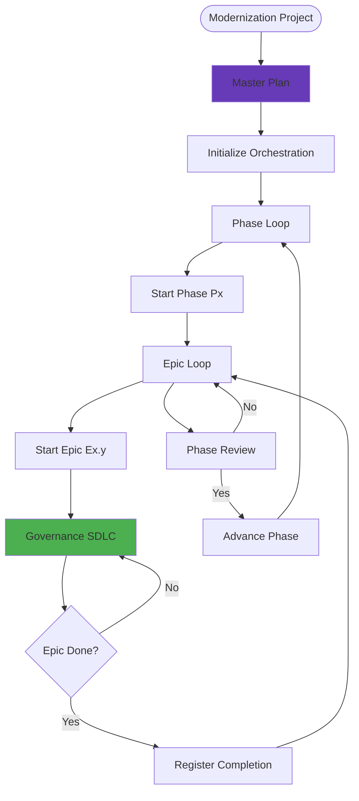

# Bulkhead Workflow Scenarios - Flow Diagrams

This document provides visual flow diagrams for various scenarios demonstrating how Bulkhead governance works. All interactions start with the `/bulkhead` smart router.

---

## Scenario 1: New Feature Development (Full SDLC)

```mermaid
graph TD
    Start([New Feature Request]) --> Bulkhead["Bulkhead Orchestrator"]
    
    Bulkhead --> P0["Phase 0: Triage"]
    P0 --> P0Decision{Worth&#10;investing?}
    P0Decision -->|No| Reject([Document & Reject])
    P0Decision -->|Yes| P1["Phase 1: Context"]
    
    P1 --> P1Doc["Document scope,&#10;dependencies, impact"]
    P1Doc --> P2["Phase 2: Design"]
    
    P2 --> P2Review["Architecture Review"]
    P2Review --> P2Decision{Design&#10;approved?}
    P2Decision -->|Issues Found| P2
    P2Decision -->|Approved| P3["Phase 3: Security"]
    
    P3 --> Sec["Security Audit"]
    Sec --> P3Decision{Security&#10;risks OK?}
    P3Decision -->|Unacceptable| P2
    P3Decision -->|Mitigated| P4["Phase 4: Decision"]
    
    P4 --> P4Decision{Proceed?}
    P4Decision -->|No| Stop([Stop Development])
    P4Decision -->|Yes| P5["Phase 5: Plan"]
    
    P5 --> GitProject["Project Tracking&#10;(Sync GitHub)"]
    GitProject --> Checkpoint["Governance Checkpoint"]
    
    Checkpoint --> CheckOK{All artifacts&#10;complete?}
    CheckOK -->|Missing| P5
    CheckOK -->|Complete| P6["Phase 6: Execute"]
    
    P6 --> Code[Implement Design]
    Code --> P7["Phase 7: Verify"]
    
    P7 --> Tests["Quality Gate&#10;(Run Tests)"]
    Tests --> CodeRev["Code Review"]
    CodeRev --> P7Decision{Quality&#10;passed?}
    P7Decision -->|Issues| P6
    P7Decision -->|Passed| Changelog["Update Changelog"]
    
    Changelog --> Done([Merge & Deploy])
    
    style Bulkhead fill:#4CAF50
    style P0 fill:#2196F3
    style P1 fill:#2196F3
    style P2 fill:#2196F3
    style P3 fill:#2196F3
    style P4 fill:#FF9800
    style P5 fill:#9C27B0
    style P6 fill:#9C27B0
    style P7 fill:#9C27B0
    style Checkpoint fill:#FF5722
```

### Step-by-Step Guide
1. **Governance Gates (Phases 0-4)**: Use `/bulkhead` to initiate. Establish economic viability, impact, design, and security. Finally, obtain sign-off at the Decision Gate.
2. **Planning**: Use `/bulkhead` (Project Menu) to break down tasks and sync them to your project board.
3. **Execution**: Implement the design in Phase 6, then verify against acceptance criteria in Phase 7 using the `/bulkhead` execution flows.
4. **Completion**: Use the `/bulkhead` Post-Completion menu to update the changelog and prepare the PR.

---

## Scenario 2: Legacy System Modernization

```mermaid
graph TD
    Start(["Legacy System&#10;Needs Update"]) --> Status["Check Governance State"]
    
    Status --> SpecMod["Modernization Analysis"]
    
    SpecMod --> Analysis["Analyze technical debt,&#10;coverage, and biz logic"]
    
    Analysis --> RebuildRefactor["Decision Matrix"]
    
    RebuildRefactor --> Metrics["Calculate cost,&#10;risk, and timeline"]
    
    Metrics --> Decision{Decision?}
    
    Decision -->|REFACTOR| RefactorPath[Refactor Path]
    Decision -->|REBUILD| RebuildPath[Rebuild Path]
    
    RefactorPath --> RefArch["Refactor Architecture"]
    RefArch --> RefPlan["Phased extraction plan"]
    RefPlan --> BulkheadRefactor["Bulkhead Orchestrator"]
    
    RebuildPath --> BulkheadRebuild["Bulkhead Orchestrator"]
    
    BulkheadRefactor --> Phases1["Phased Execution&#10;(SDLC 0-7)"]
    BulkheadRebuild --> Phases2["Full SDLC Flow&#10;(New System)"]
    
    Phases1 --> Complete([Modernization Complete])
    Phases2 --> Complete
    
    style SpecMod fill:#673AB7
    style RebuildRefactor fill:#FF9800
    style RefArch fill:#673AB7
    style Decision fill:#FF5722
    style BulkheadRefactor fill:#4CAF50
    style BulkheadRebuild fill:#4CAF50
```

### Legacy Modernization Flow
1. **Analysis**: Use the Modernization workflow to assess the system and analytically compare the cost and risk of refactoring vs rebuilding.
2. **Refactor Path**: Use the Refactoring tools to plan component extraction and execute via phased governance.
3. **Rebuild Path**: Treat as a standard "Greenfields" project using the `/bulkhead` start menu.

---

## Scenario 3: Security-First Infrastructure Change

```mermaid
graph TD
    Start(["Infrastructure&#10;Change Request"]) --> Check["Check INFRA-3:&#10;Decision required"]
    
    Check --> P0["Phase 0: Triage"]
    
    P0 --> P0Check{Approved?}
    P0Check -->|No| Stop([Stop])
    P0Check -->|Yes| P1["Phase 1: Context"]
    
    P1 --> BlastRadius["Identify Network&#10;exposure/exposure"]
    
    BlastRadius --> P2["Phase 2: Design"]
    
    P2 --> ArchReview["Architecture Review"]
    
    ArchReview --> InfraCheck{"INFRA-1&#10;All explicit?"}
    InfraCheck -->|Defaults Found| P2
    InfraCheck -->|All Explicit| P3["Phase 3: Security"]
    
    P3 --> SecArch["Security Review"]
    
    SecArch --> ThreatModel["STRIDE modeling&#10;(INFRA-2)"]
    
    ThreatModel --> SecCheck{"INFRA-5&#10;Network change?"}
    SecCheck -->|Yes| DeepReview["Deep Network Review&#10;(Ingress/Egress)"]
    SecCheck -->|No| SecretCheck
    
    DeepReview --> SecretCheck{"INFRA-4&#10;Secrets OK?"}
    SecretCheck -->|Inline Found| P3
    SecretCheck -->|Properly Managed| P4["Phase 4: Decision"]
    
    P4 --> CreateDecision["Document Decision&#10;(04-decision.md)"]
    CreateDecision --> P4Approve{Approved?}
    P4Approve -->|No| Stop2([Stop])
    P4Approve -->|Yes| Proceed["Proceed to Execution"]
    
    Proceed --> Deploy([Apply Plan])
    
    style P3 fill:#F44336
    style SecArch fill:#F44336
    style ThreatModel fill:#F44336
    style DeepReview fill:#FF5722
```

### Security-First Protocol (INFRA Rules)
**Approvals Required**: Security Architect, Infrastructure Lead.

1. **INFRA-1 (No Defaults)**: All ports, networks, and creds must be explicit in design documents.
2. **INFRA-2 (Threat Model)**: Dedicated security artifact (`03-security.json`) is mandatory.
3. **INFRA-3 (Decision Record)**: Signed record required before any provisioning.
4. **INFRA-5 (Network)**: No fast-tracking for network changes.

**Workflow**: All security checks are integrated into the standard `/bulkhead` flow for Major/Critical changes.

---

## Scenario 4: Continuous Development Cycle

```mermaid
graph TD
    Start(["Developer Ready&#10;to Work"]) --> Status["Check Status"]
    
    Status --> StatusCheck{"Current&#10;Phase?"}
    
    StatusCheck -->|None| NewWork["Start New Work"]
    StatusCheck -->|Planning| Planning["Continue Planning"]
    StatusCheck -->|Execution| Execution["Continue Execution"]
    StatusCheck -->|Review| Review["Address Feedback"]
    
    NewWork --> FullCycle["Execute SDLC Flow"]
    
    Planning --> UpdateArtifacts["Update Artifacts"]
    UpdateArtifacts --> PlanningReview["Integrated Review"]
    PlanningReview --> CheckPoint1["Governance Checkpoint"]
    CheckPoint1 --> Proceed1{Complete?}
    Proceed1 -->|No| Planning
    Proceed1 -->|Yes| ToExecution[Execution]
    
    Execution --> GitSync["Update Project Status"]
    GitSync --> WriteCode[Implement Features]
    WriteCode --> Verify["Run Verifications"]
    Verify --> VerifyOK{All Pass?}
    VerifyOK -->|No| Execution
    VerifyOK -->|Yes| CreatePR[Create PR]
    
    CreatePR --> CodeReviewFlow["Review Process"]
    
    Review --> AddressComments[Fix Issues]
    AddressComments --> Reverify[Re-verify]
    Reverify --> UpdatePR[Update PR]
    
    CodeReviewFlow --> ReviewDecision{Approved?}
    UpdatePR --> CodeReviewFlow
    
    ReviewDecision -->|Changes Requested| Review
    ReviewDecision -->|Approved| UpdateLog["Update Changelog"]
    
    UpdateLog --> Merge([Merge to Main])
    ToExecution --> Execution
    FullCycle --> Merge
    
    Merge --> Status
    
    style Status fill:#4CAF50
    style Merge fill:#4CAF50
```

### Daily Developer Workflow
1. **Morning**: Check current project status via `/bulkhead status`.
2. **Coding**: Use `/bulkhead continue` to restore context (branch, phase, active task) and resume implementation.
3. **Review**: Use the integrated delivery tools to create PRs and manage the merge process.

---

## Scenario 5: Parallel Work Management

```mermaid
graph TD
    Start(["Multiple Teams&#10;Working"]) --> Team1[Team 1: Feature A]
    Start --> Team2[Team 2: Feature B]
    Start --> Team3[Team 3: Security Audit]
    
    Team1 --> B1["Bulkhead SDLC Flow"]
    Team2 --> B2["Bulkhead SDLC Flow"]
    Team3 --> SecOnly["Integrated Security Audit"]
    
    B1 --> GP1["Project Board: A"]
    B2 --> GP2["Project Board: B"]
    
    GP1 --> Branch1["Branch Strategy"]
    GP2 --> Branch2["Branch Strategy"]
    
    Branch1 --> Execute1["Isolated SDLC"]
    Branch2 --> Execute2["Isolated SDLC"]
    SecOnly --> SecReport["Audit Findings"]
    
    Execute1 --> PR1[PR: Feature A]
    Execute2 --> PR2[PR: Feature B]
    SecReport --> SecIssues["Backlog Items"]
    
    PR1 --> CR1["Code Review"]
    PR2 --> CR2["Code Review"]
    
    SecIssues --> PriorityCheck{Critical?}
    PriorityCheck -->|Yes| HotfixBulkhead["Emergency Workflow"]
    PriorityCheck -->|No| Backlog[Normal Backlog]
    
    CR1 --> Merge1{Conflicts?}
    CR2 --> Merge2{Conflicts?}
    
    Merge1 -->|No| M1[Merge A]
    Merge2 -->|No| M2[Merge B]
    Merge1 -->|Yes| Resolve1[Resolve]
    Merge2 -->|Yes| Resolve2[Resolve]
    
    Resolve1 --> CR1
    Resolve2 --> CR2
    
    HotfixBulkhead --> HotfixPR[Hotfix PR]
    HotfixPR --> CRSec["Security Review"]
    CRSec --> MergeSec[Merge Fix]
    
    M1 --> CL1[Update Changelog]
    M2 --> CL1
    MergeSec --> CL1
    
    CL1 --> Done([Release])
    Backlog --> Done
    
    style Done fill:#4CAF50
```

### Parallel Work Management
Orchestrates multiple teams working on features and audits simultaneously.

- **Isolation**: Each team runs an isolated SDLC using the orchestrator to track separate epics/branches.
- **Security**: Audits run in parallel, injecting critical findings directly into the project backlog.
- **Merge**: Automated conflict detection and changelog handling ensure a clean unified history.

---

## Scenario 6: Emergency Response (Hotfix)

```mermaid
graph TD
    Start(["Production Issue&#10;Detected"]) --> Severity{Severity?}
    
    Severity -->|P0 - Critical| Emergency[Emergency Response]
    Severity -->|P1-P2| Standard[Standard Process]
    
    Emergency --> HotfixBranch["Create hotfix branch"]
    HotfixBranch --> FastTrack["Condensed SDLC Pass"]
    
    FastTrack --> QuickDesign["Quick Design review"]
    QuickDesign --> InfraCheck{"Infra involved?"}
    
    InfraCheck -->|Yes| InfraRules["INFRA-5 Rules Applied"]
    InfraCheck -->|No| P3Fast["Expedited P3 review"]
    
    InfraRules --> FullSec["Security Review"]
    FullSec --> P4Gate["Decision Gate"]
    
    P3Fast --> SecOK{"Security&#10;OK?"}
    SecOK -->|No| FullSec
    SecOK -->|Yes| P4Gate
    
    P4Gate --> Approve{Approved?}
    Approve -->|No| Stop([Stop])
    Approve -->|Yes| QuickImpl[Implementation]
    
    QuickImpl --> TestHotfix["Fast Verification"]
    TestHotfix --> TestOK{Tests Pass?}
    TestOK -->|No| QuickImpl
    TestOK -->|Yes| ExpressReview[Expedited Review]
    
    ExpressReview --> Deploy([Deploy Hotfix])
    
    Standard --> BulkheadStd["Standard Workflow"]
    BulkheadStd --> NormalDeploy([Normal Deployment])
    
    Deploy --> Postmortem["Capture Learnings"]
    Postmortem --> ChangelogHotfix["Notify Stakeholders"]
    ChangelogHotfix --> Monitor([Monitor])
    
    style Emergency fill:#F44336
    style InfraRules fill:#FF5722
    style Deploy fill:#4CAF50
```

### Emergency Hotfix Protocol (P0)
**Goal**: Rapid resolution while maintaining critical safety rails.

1. **Fast-Track Entry**: Use `/bulkhead` and select the **CRITICAL** classification to unlock the emergency path.
2. **Condensed Governance**: Phases 0-2 are evaluated in a single context pass.
   > **⚠️ WARNING**: Infrastructure changes (INFRA-5) **NEVER** skip security reviews, even in emergencies.
3. **Delivery**: Automated verification and expedited human review before deployment.

---

## Scenario 7: Refactoring Decision Flow

```mermaid
graph TD
    Start(["Legacy Issues"]) --> Initial[Initial Assessment]
    
    Initial --> SpecMod["Modernization Analysis"]
    
    SpecMod --> Gather["Gather structural data"]
    
    Gather --> RvR["Decision Matrix"]
    
    RvR --> Metrics[Metric Calculation]
    
    Metrics --> TechDebt["Tech Debt Score"]
    Metrics --> TestCov["Safety %"]
    Metrics --> BizLogic["Logic Clarity"]
    Metrics --> RefactorCost["Refactor Estimate"]
    Metrics --> RebuildCost["Rebuild Estimate"]
    
    TechDebt --> Decision{"Decision&#10;Logic"}
    TestCov --> Decision
    BizLogic --> Decision
    RefactorCost --> Decision
    RebuildCost --> Decision
    
    Decision -->|REFACTOR| RefactorDecision["Refactor Decision"]
    Decision -->|REBUILD| RebuildDecision["Rebuild Decision"]
    
    RefactorDecision --> RefArch["Refactor Planning"]
    
    RefArch --> ComponentAnalysis[Component mapping]
    ComponentAnalysis --> ExtractComps[Define extractions]
    ExtractComps --> TechSurvey["Survey targets"]
    TechSurvey --> PhasedPlan["Phased Roadmap"]
    
    PhasedPlan --> PhaseLoop[Loop each Phase]
    
    PhaseLoop --> PhaseBulkhead["Bulkhead Execution"]
    PhaseBulkhead --> PhaseComplete{"More?"}
    PhaseComplete -->|Yes| PhaseLoop
    PhaseComplete -->|No| RefactorDone([Complete])
    
    RebuildDecision --> NewDesign[Design New System]
    NewDesign --> BulkheadNew["Build New System"]
    BulkheadNew --> RebuildComplete([Complete])
    
    style SpecMod fill:#673AB7
    style RvR fill:#FF9800
    style RefArch fill:#673AB7
    style Decision fill:#FF5722
```

### Refactoring Decision Matrix
Data-driven approach to architectural changes.

1. **Calculate Metrics**: Compare Technical Debt and Safety scores.
2. **Cost Analysis**: Weigh Refactor Effort against Rebuild Capital.
3. **Execution**: Both paths lead to standard `/bulkhead` SDLC governance to ensure the transformation is documented and verified.

---

## Scenario 8: Large Codebase Orchestration

### Large Codebase Flow
Designed for modernization projects with a nested hierarchy.

1. **Hierarchy**: Project -> Phase -> Epic -> SDLC.
2. **Orchestration**: Centrally manages dependencies and phase-level gates.
3. **Execution**: Each individual epic follows the full standard governance flow.

---

## Quick Reference: Core Concepts

### Governance States
- **Planning**: Phases 0-4 (Design, Security, Approval)
- **Execution**: Phases 5-7 (Implementation, Verification)
- **Delivery**: Post-Phase 7 (PR, Changelog, Learnings)

### Critical Rules
- **AI Governance**: No coding until Phase 4 (Approved Decision Record).
- **INFRA Overrides**: Infrastructure changes trigger stricter security requirements.
- **Traceability**: All actions logged in `audit.log` and architecture artifacts.
