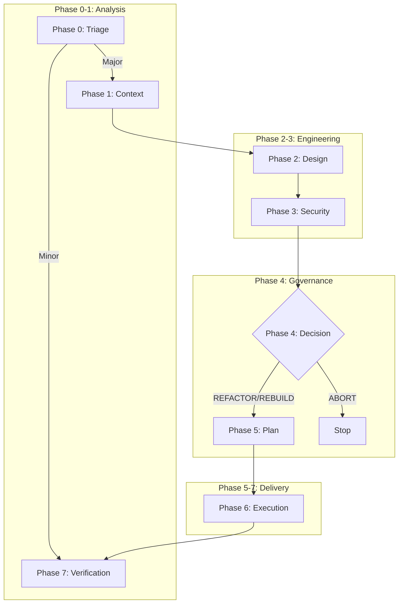

# AI-Assisted SDLC: Flow & Governance (Hybrid Model)

**Version:** 2.0.0 (Hybrid)  
**Status:** Active  
**System Authority:** Highest  

---

## 1. System Philosophy

1.  **The Double-Write Rule:** Every phase MUST produce two artifacts:
    *   **Human Readable:** `.md` for reasoning and audit.
    *   **Machine Enforceable:** `.json` for strict validation and automation.
2.  **The Ledger is Truth:** State is maintained in the `architecture/` directory. If it involves a file change, it’s a commit.
3.  **Strict Serialization:** Phases cannot be skipped. Phase N requires Phase N-1's artifacts.
4.  **Separation of Powers:**
    *   **AI:** Analyst, Designer, Coder.
    *   **Human:** Strategic Decision Maker (Phase 4).
    *   **Automation:** Enforcer (CI/CD).

---

## 2. Master Workflow (The 8 Phases)

---

## 3. Protocol Definitions

### Phase 0: Triage (Economic Control)
*   **Goal:** Classify work to prevent over-engineering simple tasks.
*   **Artifacts:** `00-triage.md`, `00-triage.json`
*   **Schema:** `schemas/triage-decision.schema.json`

### Phase 1: Context (Blast Radius)
*   **Goal:** Identify dependencies, constraints, and the "Blast Radius".
*   **Artifacts:** `01-context.md`, `01-context.json`
*   **Schema:** `schemas/context-spec.schema.json`

### Phase 2: Design (Architecture)
*   **Goal:** Propose technical solutions. The "Thinking" phase.
*   **Artifacts:** `02-design.md`, `02-design.json`
*   **Schema:** `schemas/design-spec.schema.json`

### Phase 3: Security (Auditor)
*   **Goal:** Threat modeling the *Design* before it is built.
*   **Artifacts:** `03-security.md`, `03-security.json`
*   **Schema:** `schemas/security-report.schema.json`

### Phase 4: Governance (The Human Firewall)
*   **Goal:** Strategic Authorization.
*   **Rule:** The AI **CANNOT** proceed past this point without a Human Signature.
*   **Artifacts:** `04-decision.md` (Signed), `04-decision.json`
*   **Schema:** `schemas/decision-record.schema.json`

### Phase 5: Plan (Orchestration)
*   **Goal:** Convert the decision into a deterministic task list.
*   **Artifacts:** `05-plan.md`, `05-plan.json`
*   **Schema:** `schemas/execution-plan.schema.json`

### Phase 6: Execution (The Builder)
*   **Goal:** Code generation based *strictly* on the Plan.
*   **Artifacts:** `06-report.md` (Log of changes)

### Phase 7: Verification (The Gate)
*   **Goal:** Prove it works.
*   **Artifacts:** `07-verify.md`

---

## 4. Artifact Schemas (The Handshake)

All JSON artifacts used in the Double-Write rule must validate against the schemas located in `schemas/`.

1.  **Triage:** `triage-decision.schema.json`
2.  **Context:** `context-spec.schema.json`
3.  **Design:** `design-spec.schema.json`
4.  **Security:** `security-report.schema.json`
5.  **Decision:** `decision-record.schema.json`
6.  **Plan:** `execution-plan.schema.json`
