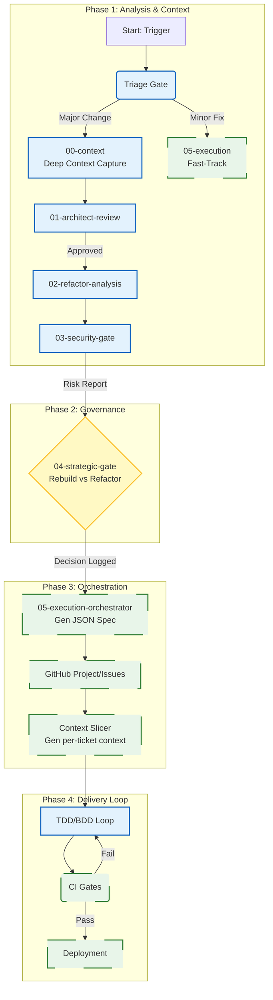

# AI-Assisted SDLC: Flow & Governance

**Version:** 1.2.0  
**Status:** Active  
**System Authority:** Highest (Overrides ad-hoc decisions)

---

## 1. System Philosophy

- **Decoupling:** This system decouples Analysis (AI), Decision (Human), and Execution (Automation).
- **State Persistence:** Every step writes a committed artifact. The system is resumable at any point.
- **Security First:** Security analysis occurs *before* architectural decisions to prevent sunk costs.
- **Scope Guard:** AI agents may not expand scope beyond defined artifacts and schemas without explicit human approval.
- **Triage:** Workloads are classified early.

---

## 2. Master Workflow Diagram



---

## 3. Protocol & Gate Definitions

### Phase 1: Analysis (AI Heavy)

#### Node B: Triage Gate
- **Actor:** AI Agent (Router)
- **Input:** Issue description / User Prompt
- **Logic:**
    - If complexity > 3/10 or involves architecture/security → **Major Change**.
    - If typo, css-tweak, docs → **Minor Fix**.
- **Override:** Human may force classification via label/command:
    - `/triage major`
    - `/triage minor`
- **Output:** `triage-decision.json`

#### Node C: Context Capture
- **Actor:** AI Agent (Researcher)
- **Action:** Scans codebase, maps dependencies, identifies "Blast Radius".
- **Output:** `architecture/00-context.md`

#### Node F: Security Gate (CRITICAL)
- **Actor:** AI Agent (SecOps) + Tools (SAST/SCA)
- **Action:** Performs Threat Modeling on the proposed architecture.
- **Output:** `architecture/03-security-report.md`

### Phase 2: Governance (Human Authority)

#### Node H: Strategic Gate (Rebuild vs. Refactor)
- **Actor:** Human Lead
- **Role Definition:** Accountable for strategic decisions. Must be listed in `CODEOWNERS`.
- **Action:** Reviews the cost (Node E) vs. risk (Node F). Makes a binding decision.
- **Artifact:** `architecture/04-decision-record.md` (See Schema below).
- **ABORT Behavior:** If ABORT is selected:
    1. No execution artifacts are created.
    2. Architecture ledger is closed.
    3. Issue is closed with rationale.

### Phase 3: Orchestration (Automation)

#### Node G: Fast-Track Contract
- **Applicability:** Only for Triage "Minor Fix".
- **Mandatory:** Diff-only context, Unit tests, SAST-lite, Code-review gate.
- **Forbidden:** Schema changes, Auth changes, Infrastructure changes.

#### Node I: Execution Orchestrator
- **Actor:** Automation Script / CI
- **Input:** `04-decision-record.md`
- **Action:** Parses the decision and generates a machine-readable project plan.
- **Failure Handling:**
    - Partial execution must be logged.
    - Orchestrator must be idempotent (re-runs must not duplicate issues).
- **Output:** `execution-plan.json` (See Schema below).

#### Node K: Context Slicer (Enforcement)
- **Actor:** Automation Script
- **Action:** Generates strict access rules for the AI coder per ticket.
- **Output:** `context-spec.json` (See Schema below).
- **Rule:** CI fails if files outside `read_write` paths are modified.

---

## 4. Artifact Schemas (The "Handshake")

**Enforcement:** Automation must reject artifacts with unknown or unsupported schema versions.

### Schema A: Decision Record (`04-decision-record.md`)
**Why:** Humans must be explicit. AI cannot guess the strategy.

```markdown
# Strategic Decision: [Feature Name]
**Date:** YYYY-MM-DD
**Author:** [Human Name]

## Decision
[ ] **REFACTOR** (Modify existing code)
[ ] **REBUILD** (Create new service/module)
[ ] **ABORT** (Risk too high)

## Rationale
* Security Score: [High/Med/Low]
* Tech Debt Impact: [Description]

## Finality
Once approved, this decision is binding. Changes require a new decision record.

## Approval
I authorize the AI to proceed with execution based on the plan in 02-refactor-analysis
```

### Schema B: Execution Plan (`execution-plan.json`)
**Why:** This JSON drives the GitHub API. It must be strict and traceable.

```json
{
  "version": "1.0",
  "source_artifacts": [
    "architecture/02-refactor-analysis.md",
    "architecture/03-security-report.md"
  ],
  "strategy": "REFACTOR",
  "milestone_title": "Auth System Upgrade v2",
  "epics": [
    {
      "id": "EPIC-AUTH-01",
      "owner": "team-auth",
      "title": "Migrate User Schema",
      "description": "Update DB schema to support OAuth2 provider columns.",
      "tasks": [
        {
          "title": "Create Migration Script",
          "type": "database",
          "context_files": ["src/db/schema.ts", "migrations/"],
          "acceptance_criteria": ["Run without errors", "Rollback works"]
        }
      ]
    }
  ]
}
```

### Schema C: Context Spec (`context-spec.json`)
**Why:** Prevents AI from hallucinating edits outside the blast radius.

```json
{
  "ticket_id": "ISSUE-123",
  "read_only": ["src/utils/", "docs/"],
  "read_write": ["src/auth/"],
  "forbidden": ["infra/", "db/migrations/"]
}
```

---

## 5. Recovery Protocol (Resumability)

**Scenario:** The AI Agent crashes, or the session is lost during a long refactor.

**Recovery Steps:**
1. **Check the Ledger:** Look at the `architecture/` folder. Find the highest numbered file (e.g., `03-security-report.md`).
2. **Resume:**
    - If `04-decision-record.md` is **missing**: Trigger Human Review.
    - If `04-decision-record.md` is **present**: Trigger Execution Orchestrator.

**Rule:** Never re-run Analysis (Phase 1) if the artifacts already exist. Trust the ledger.
