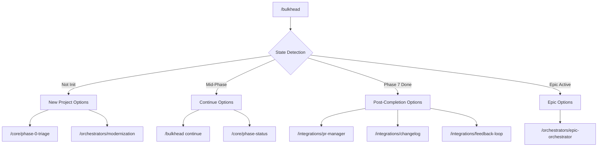

# Bulkhead Orchestrator

Smart entry point to the Bulkhead workflow ecosystem. Detects project state and routes to appropriate workflows.

---

## Quick Commands

| Command | Action |
|---------|--------|
| `/bulkhead` | Show interactive menu based on current state |
| `/bulkhead start <phase>` | Start/restart a specific phase |
| `/bulkhead continue` | Continue to next phase |
| `/bulkhead status` | Show governance dashboard |

---

## Protocol

### Step 1: Detect Project State

// turbo
```bash
# Check for bulkhead initialization
if [ ! -d .bulkhead ]; then
    echo "STATE: NOT_INITIALIZED"
    exit 0
fi

# Check current phase
CURRENT_PHASE=$(cat .bulkhead/current_phase 2>/dev/null || echo "none")

# Check rigor profile
if [ -f .bulkhead/config.yaml ]; then
    RIGOR=$(grep rigor_profile .bulkhead/config.yaml | cut -d: -f2 | tr -d ' "')
else
    RIGOR="standard"
fi

# Check for modernization/epic projects
HAS_EPIC=$([ -f .bulkhead/architecture/project-progress.json ] && echo "yes" || echo "no")
HAS_MODERNIZATION=$([ -f .bulkhead/architecture/modernization-plan.json ] && echo "yes" || echo "no")

# List existing artifacts
ARTIFACTS=$(ls .bulkhead/architecture/*.md 2>/dev/null | wc -l)

echo "STATE: INITIALIZED"
echo "CURRENT_PHASE: $CURRENT_PHASE"
echo "RIGOR: $RIGOR"
echo "HAS_EPIC: $HAS_EPIC"
echo "HAS_MODERNIZATION: $HAS_MODERNIZATION"
echo "ARTIFACT_COUNT: $ARTIFACTS"
```

### Step 2: Display Context-Aware Menu

Based on detected state, present the appropriate options:

---

#### If NOT_INITIALIZED:

```
╔══════════════════════════════════════════════════════════════╗
║                    🛡️ Bulkhead Orchestrator                   ║
╠══════════════════════════════════════════════════════════════╣
║ Status: Not initialized                                      ║
╠══════════════════════════════════════════════════════════════╣
║                                                              ║
║ 🆕 Get Started                                               ║
║    [1] Start new SDLC workflow                               ║
║        → /core/phase-0-triage                                ║
║                                                              ║
║    [2] Plan large modernization project                      ║
║        → /orchestrators/modernization                        ║
║                                                              ║
║    [3] Quick code review (standalone)                        ║
║        → /specialized/code-review                            ║
║                                                              ║
║ 📚 Learn More                                                ║
║    [4] View workflow categories                              ║
║                                                              ║
╚══════════════════════════════════════════════════════════════╝

Enter choice [1-4]:
```

---

#### If Mid-SDLC (Phase 0-6):

```
╔══════════════════════════════════════════════════════════════╗
║                    🛡️ Bulkhead Orchestrator                   ║
╠══════════════════════════════════════════════════════════════╣
║ Current: Phase <N> | Rigor: <rigor> | Artifacts: <count>     ║
╠══════════════════════════════════════════════════════════════╣
║                                                              ║
║ 📍 Continue Current Work                                     ║
║    [1] Continue to Phase <N+1>                               ║
║        → /bulkhead continue                                  ║
║                                                              ║
║    [2] View status dashboard                                 ║
║        → /core/phase-status                                  ║
║                                                              ║
║    [3] Validate checkpoint                                   ║
║        → /core/phase-checkpoint                              ║
║                                                              ║
║ 🔧 Utilities                                                 ║
║    [4] Code review → /specialized/code-review                ║
║    [5] Promote rigor → /specialized/promote                  ║
║                                                              ║
║ 🔗 Integrations                                              ║
║    [6] GitHub project → /integrations/github-project         ║
║                                                              ║
╚══════════════════════════════════════════════════════════════╝

Enter choice [1-6]:
```

---

#### If Post-Phase 7 (Verification Complete):

```
╔══════════════════════════════════════════════════════════════╗
║                    🛡️ Bulkhead Orchestrator                   ║
╠══════════════════════════════════════════════════════════════╣
║ Status: Phase 7 Complete ✅ | Ready for merge                ║
╠══════════════════════════════════════════════════════════════╣
║                                                              ║
║ 🚀 Complete This Work                                        ║
║    [1] Create/manage PR                                      ║
║        → /integrations/pr-manager                            ║
║                                                              ║
║    [2] Update changelog                                      ║
║        → /integrations/changelog                             ║
║                                                              ║
║    [3] Capture learnings                                     ║
║        → /integrations/feedback-loop                         ║
║                                                              ║
║ 🆕 Start New Work                                            ║
║    [4] Start new SDLC workflow                               ║
║        → /core/phase-0-triage                                ║
║                                                              ║
║    [5] Continue epic orchestrator                            ║
║        → /orchestrators/epic-orchestrator                    ║
║                                                              ║
╚══════════════════════════════════════════════════════════════╝

Enter choice [1-5]:
```

---

#### If Large Project (Epic Orchestrator Active):

```
╔══════════════════════════════════════════════════════════════╗
║                    🛡️ Bulkhead Orchestrator                   ║
╠══════════════════════════════════════════════════════════════╣
║ Project: <name> | Phase: <P#> | Epic: <E#> | Progress: <X%>  ║
╠══════════════════════════════════════════════════════════════╣
║                                                              ║
║ 📍 Project Management                                        ║
║    [1] View project status                                   ║
║        → /orchestrators/epic-orchestrator status             ║
║                                                              ║
║    [2] Continue current epic                                 ║
║        → /bulkhead continue                                  ║
║                                                              ║
║    [3] Start next epic                                       ║
║        → /orchestrators/epic-orchestrator next               ║
║                                                              ║
║ 🔗 Integrations                                              ║
║    [4] GitHub project → /integrations/github-project         ║
║    [5] PR manager → /integrations/pr-manager                 ║
║                                                              ║
╚══════════════════════════════════════════════════════════════╝

Enter choice [1-5]:
```

---

### Step 3: Route to Selected Workflow

Based on user selection, invoke the appropriate workflow:

```bash
case $CHOICE in
    1) # Invoke workflow based on context
       ;;
    *) echo "Invalid choice"
       ;;
esac
```

---

## Workflow Categories

| Category | Path | Purpose |
|----------|------|---------|
| **Core SDLC** | `/core/` | 8-phase governance workflows |
| **Orchestrators** | `/orchestrators/` | Large project management |
| **Integrations** | `/integrations/` | External tool connections |
| **Specialized** | `/specialized/` | Focused single-purpose workflows |

Run `/bulkhead categories` to list all available workflows.

---

## Subcommands

### `/bulkhead start <phase-id>`

Initialize or restart a specific phase:

// turbo
1. Check prerequisites:
   ```bash
   ls .bulkhead/architecture/ 2>/dev/null || mkdir -p .bulkhead/architecture
   git status --porcelain
   ```

2. Validate phase dependencies (Phase N requires Phase N-1 artifacts)

3. Set phase marker:
   ```bash
   echo "<phase-id>" > .bulkhead/current_phase
   echo "$(date -Iseconds) START <phase-id>" >> .bulkhead/audit.log
   ```

4. Invoke: `/core/phase-<N>-<name>`

### `/bulkhead continue`

Transition to the next phase:

// turbo
1. Read current phase:
   ```bash
   CURRENT=$(cat .bulkhead/current_phase 2>/dev/null || echo "none")
   ```

2. Run `/core/phase-checkpoint` for validation

3. Calculate next phase:
   - Phase 0 → Phase 1 (or Phase 5 if MINOR)
   - Phase 1 → Phase 2 → Phase 3 → Phase 4 (🔒) → Phase 5 → Phase 6 → Phase 7

4. If Phase 4:
   ```
   ⚠️  HUMAN GATE AHEAD
   Phase 4 requires human review and signature.
   ```

5. Invoke `/bulkhead start <next-phase>`

### `/bulkhead status`

Display governance dashboard: Invoke `/core/phase-status`

### `/bulkhead categories`

List all workflow categories and their contents:

```
📚 Bulkhead Workflow Categories

/core/ - Core SDLC (10 workflows)
  phase-0-triage, phase-1-context, phase-2-design, phase-3-security,
  phase-4-decision, phase-5-plan, phase-6-execute, phase-7-verify,
  phase-checkpoint, phase-status

/orchestrators/ - Large Projects (2 workflows)
  epic-orchestrator, modernization

/integrations/ - External Tools (4 workflows)
  github-project, pr-manager, changelog, feedback-loop

/specialized/ - Focused Tasks (3 workflows)
  code-review, refactoring-executor, promote
```

---

## Configuration

Respects `.bulkhead/config.yaml`:

```yaml
version: "2.0"
rigor_profile: standard  # sandbox | standard | maximum
```

---

## Error Recovery

- **Missing prerequisites**: List what's missing
- **Checkpoint failure**: Offer backtrack or fix
- **Human gate pending**: Remind to sign `04-decision.md`

---

## Integration Map

