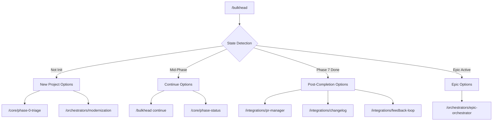

# Bulkhead Orchestrator

Smart entry point to the Bulkhead workflow ecosystem. Detects project state and routes to appropriate workflows.

---

## Quick Commands

| Command | Action |
|---------|--------|
| `/bulkhead` | Show interactive menu based on current state |
| `/bulkhead start <phase>` | Start/restart a specific phase |
| `/bulkhead continue` | Continue to next phase |
| `/bulkhead status` | Show governance dashboard |
| `/bulkhead skills` | List/load domain expertise skills |

---

## Protocol

### Step 1: Detect Project State

// turbo
```bash
# Check for bulkhead initialization
if [ ! -d .bulkhead ]; then
    echo "STATE: NOT_INITIALIZED"
    exit 0
fi

# Check current phase
CURRENT_PHASE=$(cat .bulkhead/current_phase 2>/dev/null || echo "none")

# Check rigor profile
if [ -f .bulkhead/config.yaml ]; then
    RIGOR=$(grep rigor_profile .bulkhead/config.yaml | cut -d: -f2 | tr -d ' "')
else
    RIGOR="standard"
fi

# Check for modernization/epic projects
HAS_EPIC=$([ -f .bulkhead/architecture/project-progress.json ] && echo "yes" || echo "no")
HAS_MODERNIZATION=$([ -f .bulkhead/architecture/modernization-plan.json ] && echo "yes" || echo "no")

# List existing artifacts
ARTIFACTS=$(ls .bulkhead/architecture/*.md 2>/dev/null | wc -l)

echo "STATE: INITIALIZED"
echo "CURRENT_PHASE: $CURRENT_PHASE"
echo "RIGOR: $RIGOR"
echo "HAS_EPIC: $HAS_EPIC"
echo "HAS_MODERNIZATION: $HAS_MODERNIZATION"
echo "ARTIFACT_COUNT: $ARTIFACTS"
```

### Step 2: Display Context-Aware Menu

Display menu based on state. Status bar shows: `Phase <N> | Rigor: <profile> | Artifacts: <count>`

**Menu Options by State:**

| State | Options |
|-------|---------|
| **NOT_INITIALIZED** | `[1]` Start SDLC → `/core/phase-0-triage`<br>`[2]` Modernization → `/orchestrators/modernization`<br>`[3]` Code review → `/specialized/code-review` |
| **Mid-SDLC (P0-6)** | `[1]` Continue → `/bulkhead continue`<br>`[2]` Status → `/core/phase-status`<br>`[3]` Checkpoint → `/core/phase-checkpoint`<br>`[4]` Code review<br>`[5]` Promote rigor<br>`[6]` GitHub project |
| **Post-Phase 7** | `[1]` PR → `/integrations/pr-manager`<br>`[2]` Changelog → `/integrations/changelog`<br>`[3]` Learnings → `/integrations/feedback-loop`<br>`[4]` New SDLC<br>`[5]` Epic orchestrator |
| **Epic Active** | `[1]` Project status<br>`[2]` Continue epic<br>`[3]` Next epic<br>`[4]` GitHub project<br>`[5]` PR manager |

### Step 3: Route to Selected Workflow

Invoke the workflow corresponding to user selection.

---

## Workflow Categories

| Category | Path | Purpose |
|----------|------|---------|
| **Core SDLC** | `/core/` | 8-phase governance workflows |
| **Orchestrators** | `/orchestrators/` | Large project management |
| **Integrations** | `/integrations/` | External tool connections |
| **Specialized** | `/specialized/` | Focused single-purpose workflows |

---

## Subcommands

### `/bulkhead start <phase-id>`

Initialize or restart a specific phase:

// turbo
1. Check prerequisites:
   ```bash
   ls .bulkhead/architecture/ 2>/dev/null || mkdir -p .bulkhead/architecture
   git status --porcelain
   ```

2. Validate phase dependencies (Phase N requires Phase N-1 artifacts)

3. Set phase marker:
   ```bash
   echo "<phase-id>" > .bulkhead/current_phase
   echo "$(date -Iseconds) START <phase-id>" >> .bulkhead/audit.log
   ```

4. Invoke: `/core/phase-<N>-<name>`

### `/bulkhead continue`

Transition to the next phase:

// turbo
1. Read current phase:
   ```bash
   CURRENT=$(cat .bulkhead/current_phase 2>/dev/null || echo "none")
   ```

2. Run `/core/phase-checkpoint` for validation

3. Calculate next phase:
   - Phase 0 → Phase 1 (or Phase 5 if MINOR)
   - Phase 1 → Phase 2 → Phase 3 → Phase 4 (🔒) → Phase 5 → Phase 6 → Phase 7

4. If Phase 4:
   ```
   ⚠️  HUMAN GATE AHEAD
   Phase 4 requires human review and signature.
   ```

5. Invoke `/bulkhead start <next-phase>`

### `/bulkhead status`

Display governance dashboard: Invoke `/core/phase-status`

### `/bulkhead categories`

List all workflows (see categories table above for details).

### `/bulkhead skills`

List and load domain expertise skills:

// turbo
```bash
# Detect and display available skills
echo "🧠 Bulkhead Skills"
echo ""

# Auto-detected skills based on project
LOADED=""
if [ -f "pyproject.toml" ] || [ -f "requirements.txt" ]; then
    LOADED="$LOADED languages/python.md"
fi
if grep -q "fastapi" pyproject.toml requirements.txt 2>/dev/null; then
    LOADED="$LOADED frameworks/fastapi.md"
fi
if [ -f "tsconfig.json" ]; then
    LOADED="$LOADED languages/typescript.md"
fi

if [ -n "$LOADED" ]; then
    echo "📍 Auto-loaded for this project:"
    for skill in $LOADED; do
        echo "   ✓ $skill"
    done
    echo ""
fi

echo "📚 Available Skills:"
echo ""
echo "  languages/     python, typescript, go"
echo "  frameworks/    fastapi, nextjs, django"
echo "  architecture/  microservices, event-driven, api-design"
echo "  domains/       fintech, healthcare, e-commerce"
echo "  practices/     testing, security, performance"
echo ""
echo \"Usage: /bulkhead skill <name>  → Load specific skill\"
echo \"\"
echo \"📍 Phase Integration:\"
echo \"   • Phase 2 (Design) → architecture/* skills\"
echo \"   • Phase 3 (Security) → practices/security.md\"
echo \"   • Phase 6 (Execute) → Auto-load languages/* & frameworks/*\"
echo \"   • Phase 7 (Verify) → practices/testing.md\"
```

---

## Configuration

Respects `.bulkhead/config.yaml`:

```yaml
version: "2.0"
rigor_profile: standard  # sandbox | standard | maximum
```

### Rigor Profile: Artifact Rules

| Rigor | MD Artifacts | JSON Artifacts | Schema Validation |
|-------|--------------|----------------|-------------------|
| `sandbox` | ✅ Always | ❌ Skipped | ❌ Skipped |
| `standard` | ✅ Always | ✅ Produced | ⚠️ Recommended |
| `maximum` | ✅ Always | ✅ Produced | ✅ Enforced |

---

## Error Recovery

- **Missing prerequisites**: List what's missing
- **Checkpoint failure**: Offer backtrack or fix
- **Human gate pending**: Remind to sign `04-decision.md`

---

## Integration Map

