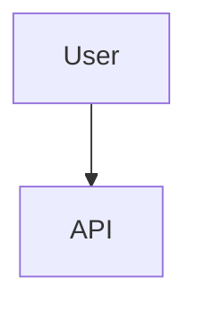

# Phase 2: Design

**Goal:** Propose technical solutions, analyze trade-offs, and define the architectural approach.

## Protocol

### 0. Load Architecture Skills

// turbo
```bash
# Load architectural patterns to inform design decisions
# Relevant skills:
# - architecture/microservices.md - Service boundaries & communication
# - architecture/event-driven.md - Events, CQRS, sagas
# - architecture/api-design.md - REST, GraphQL, versioning

echo "💡 Loading architecture skills for design phase..."

# Skills provide:
# - Proven architectural patterns
# - Trade-off analysis frameworks
# - Anti-patterns to avoid
```

### 1. Solutioning
- **Draft Options**: Consider at least 2 approaches (e.g., "Inline Logic" vs "New Service").
- **Analyze Impact**: How does this affect performance, maintainability, and security?
- **Select Winner**: Choose the best approach based on project goals.

### 2. Execution (Rigor-Conditional)

#### A. Human-Readable (ALWAYS): `.bulkhead/architecture/02-design.md`
```markdown
# Phase 2: Design

## Options Considered
1. **Option A**: [Description] - [Pros/Cons]
2. **Option B**: [Description] - [Pros/Cons]

## Selected Approach: Option A
### Architecture Definition
- **Data Flow**: User -> API -> Controller -> DB
- **New Components**: `AuthMiddleware`
- **Modified Components**: `UserController`

### Diagrams


#### B. Machine-Enforceable (standard/maximum only): `.bulkhead/architecture/02-design.json`

> **Skip if `RIGOR=sandbox`**

*Validates against `schemas/design-spec.schema.json`*
```json
{
    "phase": "design",
    "architectural_changes": [
        {
            "component": "AuthService",
            "change_type": "NEW",
            "description": "Handles JWT generation"
        }
    ],
    "component_impact": ["UserAPI", "DB"],
    "alternatives_considered": [
        {
            "name": "Session Auth",
            "pros": ["Simple"],
            "cons": ["Stateful"],
            "selected": false
        }
    ]
}
```

## Routing

> **⚠️ RE-APPROVAL REQUIRED ON EVERY ITERATION**
> 
> If this phase is being re-run (e.g., after a failed Phase 7 verification or architectural revision), 
> **previous approvals are NOT valid**. You MUST obtain fresh user approval.

### User Approval Gate

Before proceeding to Phase 3, present the design to the user and ask:

```
📐 Phase 2: Design Review

The following architectural approach has been defined:
- Selected Approach: [Option Name]
- Components Affected: [List]
- Alternatives Considered: [Count]

This is iteration #[N] of the design phase.
[If N > 1: Previous approval has been invalidated due to re-iteration.]

Do you approve this design? (Y/N/Request Changes)
```

| User Response | Action |
|---------------|--------|
| **Y (Approve)** | Proceed to **Phase 3: Security** |
| **N (Reject)** | Revise design based on feedback, re-run Phase 2 |
| **Request Changes** | Incorporate feedback, update artifacts, ask for approval again |

---

**IMPORTANT**: Never assume a previous design approval carries over. Each iteration is a fresh review.
